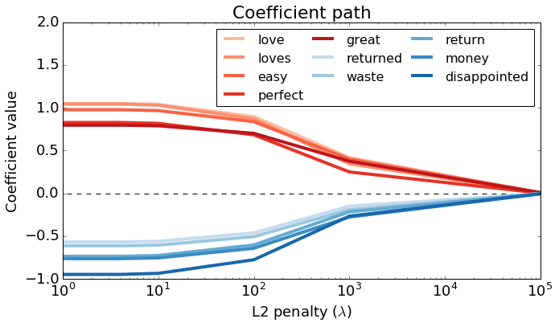
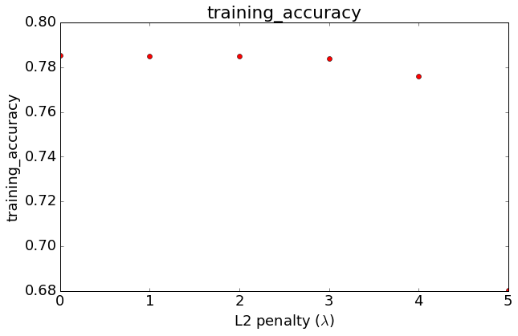
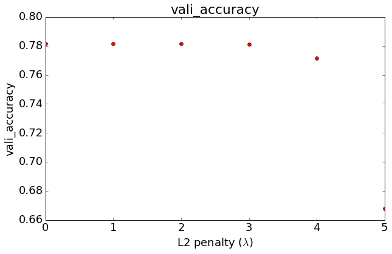
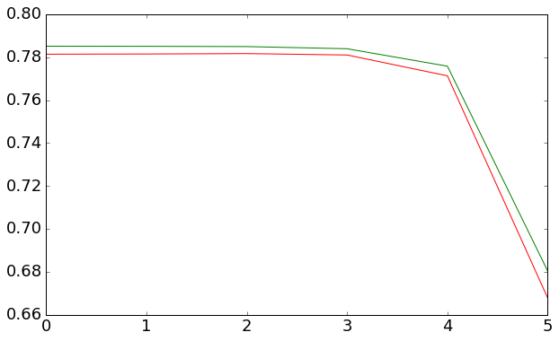

```python
import numpy as np
import pandas as pd
import json
```

## Load and process review dataset

### 1. Load the dataset into a data frame named products.


```python
products = pd.read_csv('amazon_baby_subset.csv')
```

### 2. data transformations:
- fill n/a values in the review column with empty strings
- Remove punctuation


```python
products = products.fillna({'review':''})  # fill in N/A's in the review column

def remove_punctuation(text):
    import string
    return text.translate(None, string.punctuation) 

products['review_clean'] = products['review'].apply(remove_punctuation)
products.head(3)
```


<div>
<table border="1" class="dataframe">
  <thead>
    <tr style="text-align: right;">
      <th></th>
      <th>name</th>
      <th>review</th>
      <th>rating</th>
      <th>sentiment</th>
      <th>review_clean</th>
    </tr>
  </thead>
  <tbody>
    <tr>
      <th>0</th>
      <td>Stop Pacifier Sucking without tears with Thumb...</td>
      <td>All of my kids have cried non-stop when I trie...</td>
      <td>5</td>
      <td>1</td>
      <td>All of my kids have cried nonstop when I tried...</td>
    </tr>
    <tr>
      <th>1</th>
      <td>Nature's Lullabies Second Year Sticker Calendar</td>
      <td>We wanted to get something to keep track of ou...</td>
      <td>5</td>
      <td>1</td>
      <td>We wanted to get something to keep track of ou...</td>
    </tr>
    <tr>
      <th>2</th>
      <td>Nature's Lullabies Second Year Sticker Calendar</td>
      <td>My daughter had her 1st baby over a year ago. ...</td>
      <td>5</td>
      <td>1</td>
      <td>My daughter had her 1st baby over a year ago S...</td>
    </tr>
  </tbody>
</table>
</div>


### 3. Compute word counts (only for important_words)


```python
with open('important_words.json') as important_words_file:    
    important_words = json.load(important_words_file)
print important_words[:3]
```

    [u'baby', u'one', u'great']
    


```python
for word in important_words:
    products[word] = products['review_clean'].apply(lambda s : s.split().count(word))
```

### 4. Show 'perfect' word counts


```python
products['perfect'][:3]
```


    0    0
    1    0
    2    0
    Name: perfect, dtype: int64


## Train-Validation split

### 5. split the data into a train-validation split with 80%


```python
with open('module-4-assignment-train-idx.json') as train_data_file:    
    train_data_idx = json.load(train_data_file)
with open('module-4-assignment-validation-idx.json') as validation_data_file:    
    validation_data_idx = json.load(validation_data_file)

print train_data_idx[:3]
print validation_data_idx[:3]
```

    [0, 1, 3]
    [2, 9, 23]
    


```python
print len(train_data_idx)
print len(validation_data_idx)
```

    42361
    10711
    


```python
train_data = products.iloc[train_data_idx]
train_data.head(2)
```


<div>
<table border="1" class="dataframe">
  <thead>
    <tr style="text-align: right;">
      <th></th>
      <th>name</th>
      <th>review</th>
      <th>rating</th>
      <th>sentiment</th>
      <th>review_clean</th>
      <th>baby</th>
      <th>one</th>
      <th>great</th>
      <th>love</th>
      <th>use</th>
      <th>...</th>
      <th>seems</th>
      <th>picture</th>
      <th>completely</th>
      <th>wish</th>
      <th>buying</th>
      <th>babies</th>
      <th>won</th>
      <th>tub</th>
      <th>almost</th>
      <th>either</th>
    </tr>
  </thead>
  <tbody>
    <tr>
      <th>0</th>
      <td>Stop Pacifier Sucking without tears with Thumb...</td>
      <td>All of my kids have cried non-stop when I trie...</td>
      <td>5</td>
      <td>1</td>
      <td>All of my kids have cried nonstop when I tried...</td>
      <td>0</td>
      <td>0</td>
      <td>1</td>
      <td>0</td>
      <td>0</td>
      <td>...</td>
      <td>0</td>
      <td>0</td>
      <td>0</td>
      <td>0</td>
      <td>0</td>
      <td>0</td>
      <td>0</td>
      <td>0</td>
      <td>0</td>
      <td>0</td>
    </tr>
    <tr>
      <th>1</th>
      <td>Nature's Lullabies Second Year Sticker Calendar</td>
      <td>We wanted to get something to keep track of ou...</td>
      <td>5</td>
      <td>1</td>
      <td>We wanted to get something to keep track of ou...</td>
      <td>0</td>
      <td>0</td>
      <td>0</td>
      <td>0</td>
      <td>0</td>
      <td>...</td>
      <td>0</td>
      <td>0</td>
      <td>0</td>
      <td>0</td>
      <td>0</td>
      <td>0</td>
      <td>0</td>
      <td>0</td>
      <td>0</td>
      <td>0</td>
    </tr>
  </tbody>
</table>
<p>2 rows × 198 columns</p>
</div>


```python
validation_data = products.iloc[validation_data_idx]
validation_data.head(2)
```


<div>
<table border="1" class="dataframe">
  <thead>
    <tr style="text-align: right;">
      <th></th>
      <th>name</th>
      <th>review</th>
      <th>rating</th>
      <th>sentiment</th>
      <th>review_clean</th>
      <th>baby</th>
      <th>one</th>
      <th>great</th>
      <th>love</th>
      <th>use</th>
      <th>...</th>
      <th>seems</th>
      <th>picture</th>
      <th>completely</th>
      <th>wish</th>
      <th>buying</th>
      <th>babies</th>
      <th>won</th>
      <th>tub</th>
      <th>almost</th>
      <th>either</th>
    </tr>
  </thead>
  <tbody>
    <tr>
      <th>2</th>
      <td>Nature's Lullabies Second Year Sticker Calendar</td>
      <td>My daughter had her 1st baby over a year ago. ...</td>
      <td>5</td>
      <td>1</td>
      <td>My daughter had her 1st baby over a year ago S...</td>
      <td>1</td>
      <td>0</td>
      <td>0</td>
      <td>0</td>
      <td>0</td>
      <td>...</td>
      <td>0</td>
      <td>0</td>
      <td>0</td>
      <td>0</td>
      <td>0</td>
      <td>0</td>
      <td>0</td>
      <td>0</td>
      <td>0</td>
      <td>0</td>
    </tr>
    <tr>
      <th>9</th>
      <td>Cloth Diaper Pins Stainless Steel Traditional ...</td>
      <td>It has been many years since we needed diaper ...</td>
      <td>5</td>
      <td>1</td>
      <td>It has been many years since we needed diaper ...</td>
      <td>0</td>
      <td>1</td>
      <td>0</td>
      <td>0</td>
      <td>0</td>
      <td>...</td>
      <td>0</td>
      <td>0</td>
      <td>0</td>
      <td>0</td>
      <td>0</td>
      <td>0</td>
      <td>0</td>
      <td>0</td>
      <td>0</td>
      <td>0</td>
    </tr>
  </tbody>
</table>
<p>2 rows × 198 columns</p>
</div>


###  6. Convert train_data and validation_data into multi-dimensional arrays.

Using the function given in #8 of [Module 3 assignment](https://www.coursera.org/learn/ml-classification/supplement/zU6HO/implementing-logistic-regression-from-scratch) or [Programming Assignment 2](https://github.com/SSQ/Coursera-UW-Machine-Learning-Classification/tree/master/Programming%20Assignment%202)


```python
def get_numpy_data(dataframe, features, label):
    dataframe['constant'] = 1
    features = ['constant'] + features
    features_frame = dataframe[features]
    feature_matrix = features_frame.as_matrix()
    label_sarray = dataframe[label]
    label_array = label_sarray.as_matrix()
    return(feature_matrix, label_array)
```


```python
feature_matrix_train, sentiment_train = get_numpy_data(train_data, important_words, 'sentiment')
feature_matrix_valid, sentiment_valid = get_numpy_data(validation_data, important_words, 'sentiment') 
```

    C:\Users\SSQ\AppData\Roaming\Python\Python27\site-packages\ipykernel\__main__.py:2: SettingWithCopyWarning: 
    A value is trying to be set on a copy of a slice from a DataFrame.
    Try using .loc[row_indexer,col_indexer] = value instead
    
    See the caveats in the documentation: http://pandas.pydata.org/pandas-docs/stable/indexing.html#indexing-view-versus-copy
      from ipykernel import kernelapp as app
    


```python
print feature_matrix_train.shape
print feature_matrix_valid.shape
```

    (42361L, 194L)
    (10711L, 194L)
    

## Building on logistic regression with no L2 penalty assignment

### 7. Compute predictions given by the link function.
- Take two parameters: feature_matrix and coefficients.
- First compute the dot product of feature_matrix and coefficients.
- Then compute the link function P(y=+1|x,w).
- Return the predictions given by the link function.


```python
'''
feature_matrix: N * D(intercept term included)
coefficients: D * 1
predictions: N * 1
produces probablistic estimate for P(y_i = +1 | x_i, w).
estimate ranges between 0 and 1.
'''

def predict_probability(feature_matrix, coefficients):
    # Take dot product of feature_matrix and coefficients  
    # YOUR CODE HERE
    score = np.dot(feature_matrix, coefficients) # N * 1
    
    # Compute P(y_i = +1 | x_i, w) using the link function
    # YOUR CODE HERE
    predictions = 1.0/(1+np.exp(-score))
    
    # return predictions
    return predictions
```

##  Adding L2 penalty

### 9. Adding L2 penalty to the derivative
- errors: vector whose i-th value contains
- feature: vector whose i-th value contains
- coefficient: the current value of the j-th coefficient.
- l2_penalty: the L2 penalty constant λ
- feature_is_constant: a Boolean value indicating whether the j-th feature is constant or not.

The function should do the following:

- Take the five parameters as above.
- Compute the dot product of errors and feature and save the result to derivative.
- If feature_is_constant is False, subtract the L2 penalty term from derivative. Otherwise, do nothing.
- Return derivative.


```python
def feature_derivative_with_L2(errors, feature, coefficient, l2_penalty, feature_is_constant): 
    
    # Compute the dot product of errors and feature
    ## YOUR CODE HERE
    """
    errors: N * 1
    feature: N * 1
    derivative: 1 
    coefficient: 1
    """
    derivative = np.dot(np.transpose(errors), feature)

    # add L2 penalty term for any feature that isn't the intercept.
    if not feature_is_constant: 
        ## YOUR CODE HERE
        derivative -= 2 * l2_penalty * coefficient
        
    return derivative
```

### 1. Quiz question: 
In the code above, was the intercept term regularized?

### 1. Answer:
No

### 10. computing log likelihood  with L2


```python
def compute_log_likelihood_with_L2(feature_matrix, sentiment, coefficients, l2_penalty):
    indicator = (sentiment==+1)
    scores = np.dot(feature_matrix, coefficients)
    # scores.shape (53072L, 1L)
    # indicator.shape (53072L,)
    # lp = np.sum((indicator-1)*scores - np.log(1. + np.exp(-scores))) - l2_penalty*np.sum(coefficients[1:]**2)
    lp = np.sum((np.transpose(np.array([indicator]))-1)*scores - np.log(1. + np.exp(-scores))) - l2_penalty*np.sum(coefficients[1:]**2)
    
    return lp
```

### 2. Quiz question: 
Does the term with L2 regularization increase or decrease ℓℓ(w)?

### 3. Answer:
decrease

### 11. Write a function logistic_regression_with_L2 to fit a logistic regression model under L2 regularization.

The function accepts the following parameters:

- feature_matrix: 2D array of features
- sentiment: 1D array of class labels
- initial_coefficients: 1D array containing initial values of coefficients
- step_size: a parameter controlling the size of the gradient steps
- l2_penalty: the L2 penalty constant λ
- max_iter: number of iterations to run gradient ascent
- The function returns the last set of coefficients after performing gradient ascent.

The function carries out the following steps:

- Initialize vector coefficients to initial_coefficients.
- Predict the class probability P(yi=+1|xi,w) using your predict_probability function and save it to variable predictions.
- Compute indicator value for (yi=+1) by comparing sentiment against +1. Save it to variable indicator.
- Compute the errors as difference between indicator and predictions. Save the errors to variable errors.
- For each j-th coefficient, compute the per-coefficient derivative by calling feature_derivative_L2 with the j-th column of feature_matrix. Don't forget to supply the L2 penalty. Then increment the j-th coefficient by (step_size*derivative).
- Once in a while, insert code to print out the log likelihood.
- Repeat steps 2-6 for max_iter times.


```python
# coefficients: D * 1
def logistic_regression_with_L2(feature_matrix, sentiment, initial_coefficients, step_size, l2_penalty, max_iter):
    coefficients = np.array(initial_coefficients) # make sure it's a numpy array
    for itr in xrange(max_iter):
        # Predict P(y_i = +1|x_i,w) using your predict_probability() function
        ## YOUR CODE HERE
        predictions = predict_probability(feature_matrix, coefficients)
        
        # Compute indicator value for (y_i = +1)
        indicator = (sentiment==+1)
        
        # Compute the errors as indicator - predictions
        errors = np.transpose(np.array([indicator])) - predictions
        for j in xrange(len(coefficients)): # loop over each coefficient
            is_intercept = (j == 0)
            # Recall that feature_matrix[:,j] is the feature column associated with coefficients[j].
            # Compute the derivative for coefficients[j]. Save it in a variable called derivative
            ## YOUR CODE HERE
            derivative = feature_derivative_with_L2(errors, feature_matrix[:,j], coefficients[j], l2_penalty, is_intercept)
            
            # add the step size times the derivative to the current coefficient
            ## YOUR CODE HERE
            coefficients[j] += step_size*derivative
        
        # Checking whether log likelihood is increasing
        if itr <= 15 or (itr <= 100 and itr % 10 == 0) or (itr <= 1000 and itr % 100 == 0) \
        or (itr <= 10000 and itr % 1000 == 0) or itr % 10000 == 0:
            lp = compute_log_likelihood_with_L2(feature_matrix, sentiment, coefficients, l2_penalty)
            print 'iteration %*d: log likelihood of observed labels = %.8f' % \
                (int(np.ceil(np.log10(max_iter))), itr, lp)
    return coefficients
```

## Explore effects of L2 regularization

### 12.  train models with different L2
Now that we have written up all the pieces needed for an L2 solver with logistic regression, let's explore the benefits of using L2 regularization while analyzing sentiment for product reviews. As iterations pass, the log likelihood should increase.

Let us train models with increasing amounts of regularization, starting with no L2 penalty, which is equivalent to our previous logistic regression implementation. Train 6 models with L2 penalty values 0, 4, 10, 1e2, 1e3, and 1e5. Use the following values for the other parameters:

-  feature_matrix = feature_matrix_train extracted in #7
- sentiment = sentiment_train extracted in #7
- initial_coefficients = a 194-dimensional vector filled with zeros
- step_size = 5e-6
- max_iter = 501

Save the 6 sets of coefficients as coefficients_0_penalty, coefficients_4_penalty, coefficients_10_penalty, coefficients_1e2_penalty, coefficients_1e3_penalty, and coefficients_1e5_penalty respectively.


```python
initial_coefficients = np.zeros((194,1))
step_size = 5e-6
max_iter = 501
```


```python
coefficients_0_penalty = logistic_regression_with_L2(feature_matrix_train , sentiment_train , initial_coefficients, step_size, 0, max_iter)
```

    iteration   0: log likelihood of observed labels = -29179.39138303
    iteration   1: log likelihood of observed labels = -29003.71259047
    iteration   2: log likelihood of observed labels = -28834.66187288
    iteration   3: log likelihood of observed labels = -28671.70781507
    iteration   4: log likelihood of observed labels = -28514.43078198
    iteration   5: log likelihood of observed labels = -28362.48344665
    iteration   6: log likelihood of observed labels = -28215.56713122
    iteration   7: log likelihood of observed labels = -28073.41743783
    iteration   8: log likelihood of observed labels = -27935.79536396
    iteration   9: log likelihood of observed labels = -27802.48168669
    iteration  10: log likelihood of observed labels = -27673.27331484
    iteration  11: log likelihood of observed labels = -27547.98083656
    iteration  12: log likelihood of observed labels = -27426.42679977
    iteration  13: log likelihood of observed labels = -27308.44444728
    iteration  14: log likelihood of observed labels = -27193.87673876
    iteration  15: log likelihood of observed labels = -27082.57555831
    iteration  20: log likelihood of observed labels = -26570.43059938
    iteration  30: log likelihood of observed labels = -25725.48742389
    iteration  40: log likelihood of observed labels = -25055.53326910
    iteration  50: log likelihood of observed labels = -24509.63590026
    iteration  60: log likelihood of observed labels = -24054.97906083
    iteration  70: log likelihood of observed labels = -23669.51640848
    iteration  80: log likelihood of observed labels = -23337.89167628
    iteration  90: log likelihood of observed labels = -23049.07066021
    iteration 100: log likelihood of observed labels = -22794.90974921
    iteration 200: log likelihood of observed labels = -21283.29527353
    iteration 300: log likelihood of observed labels = -20570.97485473
    iteration 400: log likelihood of observed labels = -20152.21466944
    iteration 500: log likelihood of observed labels = -19876.62333410
    


```python
coefficients_4_penalty = logistic_regression_with_L2(feature_matrix_train , sentiment_train , initial_coefficients, step_size, 4, max_iter)
```

    iteration   0: log likelihood of observed labels = -29179.39508175
    iteration   1: log likelihood of observed labels = -29003.73417180
    iteration   2: log likelihood of observed labels = -28834.71441858
    iteration   3: log likelihood of observed labels = -28671.80345068
    iteration   4: log likelihood of observed labels = -28514.58077957
    iteration   5: log likelihood of observed labels = -28362.69830317
    iteration   6: log likelihood of observed labels = -28215.85663259
    iteration   7: log likelihood of observed labels = -28073.79071393
    iteration   8: log likelihood of observed labels = -27936.26093762
    iteration   9: log likelihood of observed labels = -27803.04751805
    iteration  10: log likelihood of observed labels = -27673.94684207
    iteration  11: log likelihood of observed labels = -27548.76901327
    iteration  12: log likelihood of observed labels = -27427.33612958
    iteration  13: log likelihood of observed labels = -27309.48101569
    iteration  14: log likelihood of observed labels = -27195.04624253
    iteration  15: log likelihood of observed labels = -27083.88333261
    iteration  20: log likelihood of observed labels = -26572.49874392
    iteration  30: log likelihood of observed labels = -25729.32604153
    iteration  40: log likelihood of observed labels = -25061.34245801
    iteration  50: log likelihood of observed labels = -24517.52091982
    iteration  60: log likelihood of observed labels = -24064.99093939
    iteration  70: log likelihood of observed labels = -23681.67373669
    iteration  80: log likelihood of observed labels = -23352.19298741
    iteration  90: log likelihood of observed labels = -23065.50180166
    iteration 100: log likelihood of observed labels = -22813.44844580
    iteration 200: log likelihood of observed labels = -21321.14164794
    iteration 300: log likelihood of observed labels = -20624.98634439
    iteration 400: log likelihood of observed labels = -20219.92048845
    iteration 500: log likelihood of observed labels = -19956.11341777
    


```python
coefficients_10_penalty = logistic_regression_with_L2(feature_matrix_train , sentiment_train , initial_coefficients, step_size, 10, max_iter)
```

    iteration   0: log likelihood of observed labels = -29179.40062984
    iteration   1: log likelihood of observed labels = -29003.76654163
    iteration   2: log likelihood of observed labels = -28834.79322654
    iteration   3: log likelihood of observed labels = -28671.94687528
    iteration   4: log likelihood of observed labels = -28514.80571589
    iteration   5: log likelihood of observed labels = -28363.02048079
    iteration   6: log likelihood of observed labels = -28216.29071186
    iteration   7: log likelihood of observed labels = -28074.35036891
    iteration   8: log likelihood of observed labels = -27936.95892966
    iteration   9: log likelihood of observed labels = -27803.89576265
    iteration  10: log likelihood of observed labels = -27674.95647005
    iteration  11: log likelihood of observed labels = -27549.95042714
    iteration  12: log likelihood of observed labels = -27428.69905549
    iteration  13: log likelihood of observed labels = -27311.03455140
    iteration  14: log likelihood of observed labels = -27196.79890162
    iteration  15: log likelihood of observed labels = -27085.84308528
    iteration  20: log likelihood of observed labels = -26575.59697506
    iteration  30: log likelihood of observed labels = -25735.07304608
    iteration  40: log likelihood of observed labels = -25070.03447306
    iteration  50: log likelihood of observed labels = -24529.31188025
    iteration  60: log likelihood of observed labels = -24079.95349572
    iteration  70: log likelihood of observed labels = -23699.83199186
    iteration  80: log likelihood of observed labels = -23373.54108747
    iteration  90: log likelihood of observed labels = -23090.01500055
    iteration 100: log likelihood of observed labels = -22841.08995135
    iteration 200: log likelihood of observed labels = -21377.25595328
    iteration 300: log likelihood of observed labels = -20704.63995428
    iteration 400: log likelihood of observed labels = -20319.25685307
    iteration 500: log likelihood of observed labels = -20072.16321721
    


```python
coefficients_1e2_penalty = logistic_regression_with_L2(feature_matrix_train , sentiment_train , initial_coefficients, step_size, 1e2, max_iter)
```

    iteration   0: log likelihood of observed labels = -29179.48385120
    iteration   1: log likelihood of observed labels = -29004.25177457
    iteration   2: log likelihood of observed labels = -28835.97382190
    iteration   3: log likelihood of observed labels = -28674.09410083
    iteration   4: log likelihood of observed labels = -28518.17112932
    iteration   5: log likelihood of observed labels = -28367.83774654
    iteration   6: log likelihood of observed labels = -28222.77708939
    iteration   7: log likelihood of observed labels = -28082.70799392
    iteration   8: log likelihood of observed labels = -27947.37595368
    iteration   9: log likelihood of observed labels = -27816.54738615
    iteration  10: log likelihood of observed labels = -27690.00588850
    iteration  11: log likelihood of observed labels = -27567.54970126
    iteration  12: log likelihood of observed labels = -27448.98991327
    iteration  13: log likelihood of observed labels = -27334.14912742
    iteration  14: log likelihood of observed labels = -27222.86041863
    iteration  15: log likelihood of observed labels = -27114.96648229
    iteration  20: log likelihood of observed labels = -26621.50201299
    iteration  30: log likelihood of observed labels = -25819.72803950
    iteration  40: log likelihood of observed labels = -25197.34035501
    iteration  50: log likelihood of observed labels = -24701.03698195
    iteration  60: log likelihood of observed labels = -24296.66378580
    iteration  70: log likelihood of observed labels = -23961.38842316
    iteration  80: log likelihood of observed labels = -23679.38088853
    iteration  90: log likelihood of observed labels = -23439.31824267
    iteration 100: log likelihood of observed labels = -23232.88192018
    iteration 200: log likelihood of observed labels = -22133.50726528
    iteration 300: log likelihood of observed labels = -21730.03957488
    iteration 400: log likelihood of observed labels = -21545.87572145
    iteration 500: log likelihood of observed labels = -21451.95551390
    


```python
coefficients_1e3_penalty = logistic_regression_with_L2(feature_matrix_train , sentiment_train , initial_coefficients, step_size, 1e3, max_iter)
```

    iteration   0: log likelihood of observed labels = -29180.31606471
    iteration   1: log likelihood of observed labels = -29009.07176112
    iteration   2: log likelihood of observed labels = -28847.62378912
    iteration   3: log likelihood of observed labels = -28695.14439397
    iteration   4: log likelihood of observed labels = -28550.95060743
    iteration   5: log likelihood of observed labels = -28414.45771129
    iteration   6: log likelihood of observed labels = -28285.15124375
    iteration   7: log likelihood of observed labels = -28162.56976044
    iteration   8: log likelihood of observed labels = -28046.29387744
    iteration   9: log likelihood of observed labels = -27935.93902900
    iteration  10: log likelihood of observed labels = -27831.15045502
    iteration  11: log likelihood of observed labels = -27731.59955260
    iteration  12: log likelihood of observed labels = -27636.98108219
    iteration  13: log likelihood of observed labels = -27547.01092670
    iteration  14: log likelihood of observed labels = -27461.42422295
    iteration  15: log likelihood of observed labels = -27379.97375625
    iteration  20: log likelihood of observed labels = -27027.18208317
    iteration  30: log likelihood of observed labels = -26527.22737267
    iteration  40: log likelihood of observed labels = -26206.59048765
    iteration  50: log likelihood of observed labels = -25995.96903148
    iteration  60: log likelihood of observed labels = -25854.95710284
    iteration  70: log likelihood of observed labels = -25759.08109950
    iteration  80: log likelihood of observed labels = -25693.05688014
    iteration  90: log likelihood of observed labels = -25647.09929349
    iteration 100: log likelihood of observed labels = -25614.81468705
    iteration 200: log likelihood of observed labels = -25536.20998919
    iteration 300: log likelihood of observed labels = -25532.57691220
    iteration 400: log likelihood of observed labels = -25532.35543765
    iteration 500: log likelihood of observed labels = -25532.33970049
    


```python
coefficients_1e5_penalty = logistic_regression_with_L2(feature_matrix_train , sentiment_train , initial_coefficients, step_size, 1e5, max_iter)
```

    iteration   0: log likelihood of observed labels = -29271.85955115
    iteration   1: log likelihood of observed labels = -29271.71006589
    iteration   2: log likelihood of observed labels = -29271.65738833
    iteration   3: log likelihood of observed labels = -29271.61189923
    iteration   4: log likelihood of observed labels = -29271.57079975
    iteration   5: log likelihood of observed labels = -29271.53358505
    iteration   6: log likelihood of observed labels = -29271.49988440
    iteration   7: log likelihood of observed labels = -29271.46936584
    iteration   8: log likelihood of observed labels = -29271.44172890
    iteration   9: log likelihood of observed labels = -29271.41670149
    iteration  10: log likelihood of observed labels = -29271.39403722
    iteration  11: log likelihood of observed labels = -29271.37351294
    iteration  12: log likelihood of observed labels = -29271.35492661
    iteration  13: log likelihood of observed labels = -29271.33809523
    iteration  14: log likelihood of observed labels = -29271.32285309
    iteration  15: log likelihood of observed labels = -29271.30905015
    iteration  20: log likelihood of observed labels = -29271.25729150
    iteration  30: log likelihood of observed labels = -29271.20657205
    iteration  40: log likelihood of observed labels = -29271.18775997
    iteration  50: log likelihood of observed labels = -29271.18078247
    iteration  60: log likelihood of observed labels = -29271.17819447
    iteration  70: log likelihood of observed labels = -29271.17723457
    iteration  80: log likelihood of observed labels = -29271.17687853
    iteration  90: log likelihood of observed labels = -29271.17674648
    iteration 100: log likelihood of observed labels = -29271.17669750
    iteration 200: log likelihood of observed labels = -29271.17666862
    iteration 300: log likelihood of observed labels = -29271.17666862
    iteration 400: log likelihood of observed labels = -29271.17666862
    iteration 500: log likelihood of observed labels = -29271.17666862
    

## Compare coefficients

### 13. Analysis coefficient without penalty 


```python
coefficients_0_penalty_without_intercept = list(coefficients_0_penalty[1:]) # exclude intercept
word_coefficient_tuples = [(word, coefficient) for word, coefficient in zip(important_words, coefficients_0_penalty_without_intercept)]
word_coefficient_tuples = sorted(word_coefficient_tuples, key=lambda x:x[1], reverse=True)
```


```python
positive_words = []
for i in range(5):
    positive_words.append(word_coefficient_tuples[:5][i][0])
positive_words
```


    [u'love', u'loves', u'easy', u'perfect', u'great']


```python
negative_words = []
for i in range(5):
    negative_words.append(word_coefficient_tuples[-5:][i][0])
negative_words
```


    [u'returned', u'waste', u'return', u'money', u'disappointed']


### 14.  observe the effect of increasing L2 penalty on the 10 words


```python
table = pd.DataFrame(data=[coefficients_0_penalty.flatten(), coefficients_4_penalty.flatten(), coefficients_10_penalty.flatten(), coefficients_1e2_penalty.flatten(), coefficients_1e3_penalty.flatten(), coefficients_1e5_penalty.flatten()], 
                     index=[0, 4, 10, 100.0, 1000.0, 100000.0],
                     columns=['(intercept)'] + important_words)
```


```python
table.head(2)
```


<div>
<table border="1" class="dataframe">
  <thead>
    <tr style="text-align: right;">
      <th></th>
      <th>(intercept)</th>
      <th>baby</th>
      <th>one</th>
      <th>great</th>
      <th>love</th>
      <th>use</th>
      <th>would</th>
      <th>like</th>
      <th>easy</th>
      <th>little</th>
      <th>...</th>
      <th>seems</th>
      <th>picture</th>
      <th>completely</th>
      <th>wish</th>
      <th>buying</th>
      <th>babies</th>
      <th>won</th>
      <th>tub</th>
      <th>almost</th>
      <th>either</th>
    </tr>
  </thead>
  <tbody>
    <tr>
      <th>0.0</th>
      <td>-0.063742</td>
      <td>0.074073</td>
      <td>0.012753</td>
      <td>0.801625</td>
      <td>1.058554</td>
      <td>-0.000104</td>
      <td>-0.287021</td>
      <td>-0.003384</td>
      <td>0.984559</td>
      <td>0.524419</td>
      <td>...</td>
      <td>0.058308</td>
      <td>-0.196906</td>
      <td>-0.277845</td>
      <td>0.173191</td>
      <td>-0.132197</td>
      <td>0.052494</td>
      <td>0.004960</td>
      <td>-0.166745</td>
      <td>-0.031916</td>
      <td>-0.228852</td>
    </tr>
    <tr>
      <th>4.0</th>
      <td>-0.063143</td>
      <td>0.073994</td>
      <td>0.012495</td>
      <td>0.796897</td>
      <td>1.050856</td>
      <td>0.000163</td>
      <td>-0.286027</td>
      <td>-0.003442</td>
      <td>0.977600</td>
      <td>0.521385</td>
      <td>...</td>
      <td>0.057905</td>
      <td>-0.195273</td>
      <td>-0.275461</td>
      <td>0.171640</td>
      <td>-0.131083</td>
      <td>0.052130</td>
      <td>0.004907</td>
      <td>-0.165367</td>
      <td>-0.031621</td>
      <td>-0.226793</td>
    </tr>
  </tbody>
</table>
<p>2 rows × 194 columns</p>
</div>


```python
import matplotlib.pyplot as plt
%matplotlib inline
plt.rcParams['figure.figsize'] = 10, 6

def make_coefficient_plot(table, positive_words, negative_words, l2_penalty_list):
    cmap_positive = plt.get_cmap('Reds')
    cmap_negative = plt.get_cmap('Blues')
    
    xx = l2_penalty_list
    plt.plot(xx, [0.]*len(xx), '--', lw=1, color='k')
    
    
    table_positive_words = table[positive_words] 
    table_negative_words = table[negative_words]
    #del table_positive_words['word']
    #del table_negative_words['word']
    
    for i, value in enumerate(positive_words):
        color = cmap_positive(0.8*((i+1)/(len(positive_words)*1.2)+0.15))
        plt.plot(xx, table_positive_words[value].as_matrix().flatten(),
                 '-', label=positive_words[i], linewidth=4.0, color=color)
        
    for i, value in enumerate(negative_words):
        color = cmap_negative(0.8*((i+1)/(len(negative_words)*1.2)+0.15))
        plt.plot(xx, table_negative_words[value].as_matrix().flatten(),
                 '-', label=negative_words[i], linewidth=4.0, color=color)
        
    plt.legend(loc='best', ncol=3, prop={'size':16}, columnspacing=0.5)
    plt.axis([1, 1e5, -1, 2])
    plt.title('Coefficient path')
    plt.xlabel('L2 penalty ($\lambda$)')
    plt.ylabel('Coefficient value')
    plt.xscale('log')
    plt.rcParams.update({'font.size': 18})
    plt.tight_layout()


make_coefficient_plot(table, positive_words, negative_words, l2_penalty_list=[0, 4, 10, 1e2, 1e3, 1e5])

```





### 3. Quiz Question: 
(True/False) All coefficients consistently get smaller in size as L2 penalty is increased.

### 3. Answer:
True

## Measuring accuracy

### 15.  compute the accuracy of the classifier model.


```python
"""
feature_matrix: N * D
coefficients: D * 1
predictions: N * 1
"""
training_accuracy = []
for coefficient in [coefficients_0_penalty, coefficients_4_penalty, coefficients_10_penalty, coefficients_1e2_penalty, coefficients_1e3_penalty, coefficients_1e5_penalty]:
    predictions = predict_probability(feature_matrix_train, coefficient)
    correct_num = np.sum((np.transpose(predictions.flatten())> 0.5) == (np.array(sentiment_train)>0))
    total_num = len(sentiment_train)
    #print "correct_num: {}, total_num: {}".format(correct_num, total_num)
    training_accuracy.append(correct_num * 1./ total_num)
    #print accuracy
l2_penalty_list=[x for x in range(6)]
plt.plot(l2_penalty_list, training_accuracy,'ro')
plt.title('training_accuracy')
plt.xlabel('L2 penalty ($\lambda$)')
plt.ylabel('training_accuracy')
plt.show()
```





```python
[0, 4, 10, 1e2, 1e3, 1e5][training_accuracy.index(max(training_accuracy))]
```


    0


```python
training_accuracy[training_accuracy.index(max(training_accuracy))]
```


    0.78515615778664338


### 4. Quiz question: 
Which model (L2 = 0, 4, 10, 100, 1e3, 1e5) has the highest accuracy on the training data?
### Answer:
0


```python
vali_accuracy = []
for coefficient in [coefficients_0_penalty, coefficients_4_penalty, coefficients_10_penalty, coefficients_1e2_penalty, coefficients_1e3_penalty, coefficients_1e5_penalty]:
    predictions = predict_probability(feature_matrix_valid, coefficient)  
    correct_num = np.sum((np.transpose(predictions.flatten())> 0.5) == (np.array(sentiment_valid)>0))
    total_num = len(sentiment_valid)
    #print "correct_num: {}, total_num: {}".format(correct_num, total_num)
    vali_accuracy.append(correct_num * 1./ total_num)
    #print accuracy
l2_penalty_list=[x for x in range(6)]
plt.plot(l2_penalty_list, vali_accuracy,'ro')
plt.title('vali_accuracy')
plt.xlabel('L2 penalty ($\lambda$)')
plt.ylabel('vali_accuracy')
plt.show()                  
```





```python
[0, 4, 10, 1e2, 1e3, 1e5][vali_accuracy.index(max(vali_accuracy))]
```


    10


```python
vali_accuracy[vali_accuracy.index(max(vali_accuracy))]
```


    0.78171972738306417


### 5. Quiz question: 
Which model (L2 = 0, 4, 10, 100, 1e3, 1e5) has the highest accuracy on the validation  data?
### Answer:
10

### 6. Quiz question: 
Does the highest accuracy on the training data imply that the model is the best one?


```python
plt.plot(l2_penalty_list, training_accuracy,'g')
plt.plot(l2_penalty_list, vali_accuracy,'r')

```


    [<matplotlib.lines.Line2D at 0xbe6aa20>]





### Answer:
No


```python

```
