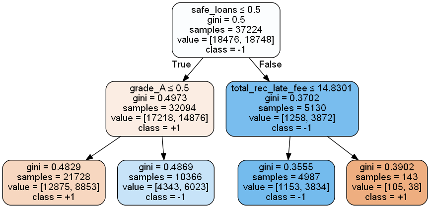

```python
import numpy as np
import pandas as pd
import json
```

## Load the Lending Club dataset

### 1. Load the dataset into a data frame named loans


```python
loans = pd.read_csv('lending-club-data.csv')
loans.head(2)
```

    C:\Users\SSQ\AppData\Roaming\Python\Python27\site-packages\IPython\core\interactiveshell.py:2717: DtypeWarning: Columns (19,47) have mixed types. Specify dtype option on import or set low_memory=False.
      interactivity=interactivity, compiler=compiler, result=result)
    


<div>
<table border="1" class="dataframe">
  <thead>
    <tr style="text-align: right;">
      <th></th>
      <th>id</th>
      <th>member_id</th>
      <th>loan_amnt</th>
      <th>funded_amnt</th>
      <th>funded_amnt_inv</th>
      <th>term</th>
      <th>int_rate</th>
      <th>installment</th>
      <th>grade</th>
      <th>sub_grade</th>
      <th>...</th>
      <th>sub_grade_num</th>
      <th>delinq_2yrs_zero</th>
      <th>pub_rec_zero</th>
      <th>collections_12_mths_zero</th>
      <th>short_emp</th>
      <th>payment_inc_ratio</th>
      <th>final_d</th>
      <th>last_delinq_none</th>
      <th>last_record_none</th>
      <th>last_major_derog_none</th>
    </tr>
  </thead>
  <tbody>
    <tr>
      <th>0</th>
      <td>1077501</td>
      <td>1296599</td>
      <td>5000</td>
      <td>5000</td>
      <td>4975</td>
      <td>36 months</td>
      <td>10.65</td>
      <td>162.87</td>
      <td>B</td>
      <td>B2</td>
      <td>...</td>
      <td>0.4</td>
      <td>1.0</td>
      <td>1.0</td>
      <td>1.0</td>
      <td>0</td>
      <td>8.1435</td>
      <td>20141201T000000</td>
      <td>1</td>
      <td>1</td>
      <td>1</td>
    </tr>
    <tr>
      <th>1</th>
      <td>1077430</td>
      <td>1314167</td>
      <td>2500</td>
      <td>2500</td>
      <td>2500</td>
      <td>60 months</td>
      <td>15.27</td>
      <td>59.83</td>
      <td>C</td>
      <td>C4</td>
      <td>...</td>
      <td>0.8</td>
      <td>1.0</td>
      <td>1.0</td>
      <td>1.0</td>
      <td>1</td>
      <td>2.3932</td>
      <td>20161201T000000</td>
      <td>1</td>
      <td>1</td>
      <td>1</td>
    </tr>
  </tbody>
</table>
<p>2 rows × 68 columns</p>
</div>


```python
print loans.shape
```

    (122607, 68)
    

## Exploring some features

### 2. print out the column names


```python
loans.columns
```


    Index([u'id', u'member_id', u'loan_amnt', u'funded_amnt', u'funded_amnt_inv',
           u'term', u'int_rate', u'installment', u'grade', u'sub_grade',
           u'emp_title', u'emp_length', u'home_ownership', u'annual_inc',
           u'is_inc_v', u'issue_d', u'loan_status', u'pymnt_plan', u'url', u'desc',
           u'purpose', u'title', u'zip_code', u'addr_state', u'dti',
           u'delinq_2yrs', u'earliest_cr_line', u'inq_last_6mths',
           u'mths_since_last_delinq', u'mths_since_last_record', u'open_acc',
           u'pub_rec', u'revol_bal', u'revol_util', u'total_acc',
           u'initial_list_status', u'out_prncp', u'out_prncp_inv', u'total_pymnt',
           u'total_pymnt_inv', u'total_rec_prncp', u'total_rec_int',
           u'total_rec_late_fee', u'recoveries', u'collection_recovery_fee',
           u'last_pymnt_d', u'last_pymnt_amnt', u'next_pymnt_d',
           u'last_credit_pull_d', u'collections_12_mths_ex_med',
           u'mths_since_last_major_derog', u'policy_code', u'not_compliant',
           u'status', u'inactive_loans', u'bad_loans', u'emp_length_num',
           u'grade_num', u'sub_grade_num', u'delinq_2yrs_zero', u'pub_rec_zero',
           u'collections_12_mths_zero', u'short_emp', u'payment_inc_ratio',
           u'final_d', u'last_delinq_none', u'last_record_none',
           u'last_major_derog_none'],
          dtype='object')


## Exploring the target column
The target column (label column) of the dataset that we are interested in is called bad_loans. In this column 1 means a risky (bad) loan 0 means a safe loan.

In order to make this more intuitive and consistent with the lectures, we reassign the target to be:

- +1 as a safe loan
- -1 as a risky (bad) loan

### 3. We put this in a new column called safe_loans.


```python
# safe_loans =  1 => safe
# safe_loans = -1 => risky
loans['safe_loans'] = loans['bad_loans'].apply(lambda x : +1 if x==0 else -1)

#loans = loans.remove_column('bad_loans')
loans = loans.drop('bad_loans', axis=1)
```

### 4. Now, let us explore the distribution of the column safe_loans.


```python
loans['safe_loans'].value_counts()
```


     1    99457
    -1    23150
    Name: safe_loans, dtype: int64


```python
print len(loans[loans['safe_loans']==+1]) *1.0/ len(loans['safe_loans'])
print len(loans[loans['safe_loans']==-1]) *1.0/ len(loans['safe_loans'])
```

    0.811185331996
    0.188814668004
    

## Features for the classification algorithm

### 5. using a subset of features (categorical and numeric)


```python
features = ['grade',                     # grade of the loan
            'sub_grade',                 # sub-grade of the loan
            'short_emp',                 # one year or less of employment
            'emp_length_num',            # number of years of employment
            'home_ownership',            # home_ownership status: own, mortgage or rent
            'dti',                       # debt to income ratio
            'purpose',                   # the purpose of the loan
            'term',                      # the term of the loan
            'last_delinq_none',          # has borrower had a delinquincy
            'last_major_derog_none',     # has borrower had 90 day or worse rating
            'revol_util',                # percent of available credit being used
            'total_rec_late_fee',        # total late fees received to day
           ]

target = 'safe_loans'                    # prediction target (y) (+1 means safe, -1 is risky)

# Extract the feature columns and target column
loans = loans[features + [target]]
```

## One-hot encoding


```python
categorical_variables = []
for feat_name, feat_type in zip(loans.columns, loans.dtypes):
    if feat_type == object:
        categorical_variables.append(feat_name)
        
for feature in categorical_variables:
    
    loans_one_hot_encoded = pd.get_dummies(loans[feature],prefix=feature)
    #print loans_one_hot_encoded
    
    loans = loans.drop(feature, axis=1)
    for col in loans_one_hot_encoded.columns:
        loans[col] = loans_one_hot_encoded[col]
    
print loans.head(2)        
print loans.columns
#pd.get_dummies(loans, prefix=['col1', 'col2'])
```

       short_emp  emp_length_num    dti  last_delinq_none  last_major_derog_none  \
    0          0              11  27.65                 1                      1   
    1          1               1   1.00                 1                      1   
    
       revol_util  total_rec_late_fee  safe_loans  grade_A  grade_B  \
    0        83.7                 0.0           1        0        1   
    1         9.4                 0.0          -1        0        0   
    
            ...         purpose_house  purpose_major_purchase  purpose_medical  \
    0       ...                     0                       0                0   
    1       ...                     0                       0                0   
    
       purpose_moving  purpose_other  purpose_small_business  purpose_vacation  \
    0               0              0                       0                 0   
    1               0              0                       0                 0   
    
       purpose_wedding  term_ 36 months  term_ 60 months  
    0                0                1                0  
    1                0                0                1  
    
    [2 rows x 68 columns]
    Index([u'short_emp', u'emp_length_num', u'dti', u'last_delinq_none',
           u'last_major_derog_none', u'revol_util', u'total_rec_late_fee',
           u'safe_loans', u'grade_A', u'grade_B', u'grade_C', u'grade_D',
           u'grade_E', u'grade_F', u'grade_G', u'sub_grade_A1', u'sub_grade_A2',
           u'sub_grade_A3', u'sub_grade_A4', u'sub_grade_A5', u'sub_grade_B1',
           u'sub_grade_B2', u'sub_grade_B3', u'sub_grade_B4', u'sub_grade_B5',
           u'sub_grade_C1', u'sub_grade_C2', u'sub_grade_C3', u'sub_grade_C4',
           u'sub_grade_C5', u'sub_grade_D1', u'sub_grade_D2', u'sub_grade_D3',
           u'sub_grade_D4', u'sub_grade_D5', u'sub_grade_E1', u'sub_grade_E2',
           u'sub_grade_E3', u'sub_grade_E4', u'sub_grade_E5', u'sub_grade_F1',
           u'sub_grade_F2', u'sub_grade_F3', u'sub_grade_F4', u'sub_grade_F5',
           u'sub_grade_G1', u'sub_grade_G2', u'sub_grade_G3', u'sub_grade_G4',
           u'sub_grade_G5', u'home_ownership_MORTGAGE', u'home_ownership_OTHER',
           u'home_ownership_OWN', u'home_ownership_RENT', u'purpose_car',
           u'purpose_credit_card', u'purpose_debt_consolidation',
           u'purpose_home_improvement', u'purpose_house',
           u'purpose_major_purchase', u'purpose_medical', u'purpose_moving',
           u'purpose_other', u'purpose_small_business', u'purpose_vacation',
           u'purpose_wedding', u'term_ 36 months', u'term_ 60 months'],
          dtype='object')
    


```python
with open('module-5-assignment-1-train-idx.json') as train_data_file:    
    train_idx  = json.load(train_data_file)
with open('module-5-assignment-1-validation-idx.json') as validation_data_file:    
    validation_idx = json.load(validation_data_file)

print train_idx[:3]
print validation_idx[:3]
```

    [1, 6, 7]
    [24, 41, 60]
    


```python
print len(train_idx)
print len(validation_idx)
```

    37224
    9284
    


```python
train_data = loans.iloc[train_idx]
validation_data = loans.iloc[validation_idx]
```


```python
print len(loans.dtypes )

```

    68
    

## Build a decision tree classifier


```python
train_Y = train_data['safe_loans'].as_matrix()
train_X = train_data.drop('safe_loans', axis=1).as_matrix()
print train_Y.shape
print train_X.shape
```

    (37224L,)
    (37224L, 67L)
    


```python
from sklearn.tree import DecisionTreeClassifier
decision_tree_model = DecisionTreeClassifier(max_depth=6)
decision_tree_model = decision_tree_model.fit(train_X, train_Y)

small_model = DecisionTreeClassifier(max_depth=2)
small_model = small_model.fit(train_X, train_Y)
```


```python
import sklearn
print('The scikit-learn version is {}.'.format(sklearn.__version__))
```

    The scikit-learn version is 0.17.1.
    

## Visualizing a learned model (Optional)


```python
from sklearn import tree
import graphviz 
from os import system

dot_data = tree.export_graphviz(small_model, out_file='simple_tree.dot',
                               feature_names=train_data.columns,  
                         class_names=['+1','-1'],  
                         filled=True, rounded=True,  
                         special_characters=True) 
system("dot -Tpng simple_tree.dot -o simple_tree.png")

from IPython.display import Image
Image(filename='simple_tree.png') 

```





## Making predictions
Let's consider two positive and two negative examples from the validation set and see what the model predicts. We will do the following:

- Predict whether or not a loan is safe.
- Predict the probability that a loan is safe.

### 11. First, let's grab 2 positive examples and 2 negative examples


```python
validation_safe_loans = validation_data[validation_data[target] == 1]
validation_risky_loans = validation_data[validation_data[target] == -1]

sample_validation_data_risky = validation_risky_loans[0:2]
sample_validation_data_safe = validation_safe_loans[0:2]

sample_validation_data = sample_validation_data_safe.append(sample_validation_data_risky)
sample_validation_data

```


<div>
<table border="1" class="dataframe">
  <thead>
    <tr style="text-align: right;">
      <th></th>
      <th>short_emp</th>
      <th>emp_length_num</th>
      <th>dti</th>
      <th>last_delinq_none</th>
      <th>last_major_derog_none</th>
      <th>revol_util</th>
      <th>total_rec_late_fee</th>
      <th>safe_loans</th>
      <th>grade_A</th>
      <th>grade_B</th>
      <th>...</th>
      <th>purpose_house</th>
      <th>purpose_major_purchase</th>
      <th>purpose_medical</th>
      <th>purpose_moving</th>
      <th>purpose_other</th>
      <th>purpose_small_business</th>
      <th>purpose_vacation</th>
      <th>purpose_wedding</th>
      <th>term_ 36 months</th>
      <th>term_ 60 months</th>
    </tr>
  </thead>
  <tbody>
    <tr>
      <th>19</th>
      <td>0</td>
      <td>11</td>
      <td>11.18</td>
      <td>1</td>
      <td>1</td>
      <td>82.4</td>
      <td>0.0</td>
      <td>1</td>
      <td>0</td>
      <td>1</td>
      <td>...</td>
      <td>0</td>
      <td>0</td>
      <td>0</td>
      <td>0</td>
      <td>0</td>
      <td>0</td>
      <td>0</td>
      <td>0</td>
      <td>1</td>
      <td>0</td>
    </tr>
    <tr>
      <th>79</th>
      <td>0</td>
      <td>10</td>
      <td>16.85</td>
      <td>1</td>
      <td>1</td>
      <td>96.4</td>
      <td>0.0</td>
      <td>1</td>
      <td>0</td>
      <td>0</td>
      <td>...</td>
      <td>0</td>
      <td>0</td>
      <td>0</td>
      <td>0</td>
      <td>0</td>
      <td>0</td>
      <td>0</td>
      <td>0</td>
      <td>1</td>
      <td>0</td>
    </tr>
    <tr>
      <th>24</th>
      <td>0</td>
      <td>3</td>
      <td>13.97</td>
      <td>0</td>
      <td>1</td>
      <td>59.5</td>
      <td>0.0</td>
      <td>-1</td>
      <td>0</td>
      <td>0</td>
      <td>...</td>
      <td>0</td>
      <td>0</td>
      <td>0</td>
      <td>0</td>
      <td>1</td>
      <td>0</td>
      <td>0</td>
      <td>0</td>
      <td>0</td>
      <td>1</td>
    </tr>
    <tr>
      <th>41</th>
      <td>0</td>
      <td>11</td>
      <td>16.33</td>
      <td>1</td>
      <td>1</td>
      <td>62.1</td>
      <td>0.0</td>
      <td>-1</td>
      <td>1</td>
      <td>0</td>
      <td>...</td>
      <td>0</td>
      <td>0</td>
      <td>0</td>
      <td>0</td>
      <td>0</td>
      <td>0</td>
      <td>0</td>
      <td>0</td>
      <td>1</td>
      <td>0</td>
    </tr>
  </tbody>
</table>
<p>4 rows × 68 columns</p>
</div>


### 12. Now, we will use our model to predict whether or not a loan is likely to default.


```python
sample_validation_data_Y = sample_validation_data['safe_loans'].as_matrix()
sample_validation_data_X = sample_validation_data.drop('safe_loans', axis=1).as_matrix()
print sample_validation_data_Y.shape
print sample_validation_data_X.shape
```

    (4L,)
    (4L, 67L)
    


```python
decision_tree_model.predict(sample_validation_data_X)
```


    array([ 1, -1, -1,  1], dtype=int64)


## Quiz Question 1: 
What percentage of the predictions on sample_validation_data did decision_tree_model get correct?

## Answer: 
0.5

## Explore probability predictions

## 13. For each row in the sample_validation_data, what is the probability (according decision_tree_model) of a loan being classified as safe? (Hint: if you are using scikit-learn, you can use the .predict_proba() method)


```python
decision_tree_model.predict_proba(sample_validation_data_X)
```


    array([[ 0.34156543,  0.65843457],
           [ 0.53630646,  0.46369354],
           [ 0.64750958,  0.35249042],
           [ 0.20789474,  0.79210526]])


## Quiz Question 2:
Which loan has the highest probability of being classified as a safe loan?

## Answer: 
4

## Tricky predictions!

### 14. Now, we will explore something pretty interesting. For each row in the sample_validation_data, what is the probability (according to small_model) of a loan being classified as safe?


```python
small_model.predict_proba(sample_validation_data_X)
```


    array([[ 0.41896585,  0.58103415],
           [ 0.59255339,  0.40744661],
           [ 0.59255339,  0.40744661],
           [ 0.23120112,  0.76879888]])


## Quiz Question 3: 
Notice that the probability preditions are the exact same for the 2nd and 3rd loans. Why would this happen?

## Quiz Question 4: 
Based on the visualized tree, what prediction would you make for this data point (according to small_model)? (If you don't have Graphviz, you can answer this quiz question by executing the next part.)

### 15. Now, verify your prediction by examining the prediction made using small_model.

## Evaluating accuracy of the decision tree model

### 16. Evaluate the accuracy of small_model and decision_tree_model on the training data. (Hint: if you are using scikit-learn, you can use the .score() method)


```python
small_model.score(train_X, train_Y)
```


    0.61350204169353106


```python
decision_tree_model.score(train_X, train_Y)
```


    0.64052761659144641


### 17. Now, evaluate the accuracy of the small_model and decision_tree_model on the entire validation_data, not just the subsample considered above.


```python
validation_Y = validation_data['safe_loans'].as_matrix()
validation_X = validation_data.drop('safe_loans', axis=1).as_matrix()
print validation_Y.shape
print validation_X.shape
```

    (9284L,)
    (9284L, 67L)
    


```python
small_model.score(validation_X, validation_Y)
```


    0.61934510986643687


```python
decision_tree_model.score(validation_X, validation_Y)
```


    0.63614821197759586


## Quiz Question 5: 
What is the accuracy of decision_tree_model on the validation set, rounded to the nearest .01?

## Answer:
0.64

## Evaluating accuracy of a complex decision tree model

### 18. Using sklearn.tree.DecisionTreeClassifier, train a decision tree with maximum depth = 10. Call this model big_model.


```python
big_model = DecisionTreeClassifier(max_depth=10)
big_model = big_model.fit(train_X, train_Y)
```

### 19. Evaluate the accuracy of big_model on the training set and validation set.


```python
big_model.score(train_X, train_Y)
```


    0.66379217709004945


```python
big_model.score(validation_X, validation_Y)
```


    0.62699267557087457


## Quiz Question 6: 
How does the performance of big_model on the validation set compare to decision_tree_model on the validation set? Is this a sign of overfitting?

## Answer:
Yes

## Quantifying the cost of mistakes


```python
predictions = decision_tree_model.predict(validation_X)
print type(predictions)
print type(validation_Y)
```

    <type 'numpy.ndarray'>
    <type 'numpy.ndarray'>
    


```python
false_positives = ((predictions==1) * (validation_Y==-1)).sum()
print false_positives
```

    1661
    


```python
false_negatives = ((predictions==-1) * (validation_Y==1)).sum()
print false_negatives
```

    1717
    


```python
correct_predictions = (predictions==validation_Y).sum()
print correct_predictions
```

    5906
    


```python
print 10000 * false_negatives + 20000 * false_positives
```

    50390000
    


```python

```
