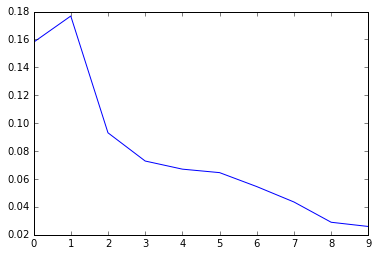
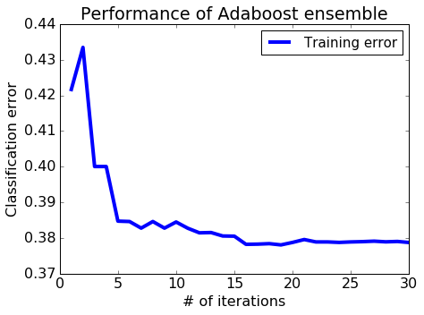
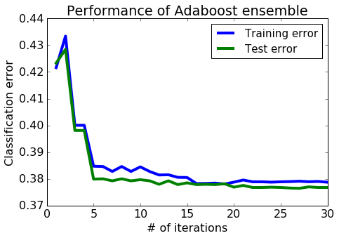

# Boosting a decision stump

The goal of this notebook is to implement your own boosting module.

**Brace yourselves**! This is going to be a fun and challenging assignment.


* Use SFrames to do some feature engineering.
* Modify the decision trees to incorporate weights.
* Implement Adaboost ensembling.
* Use your implementation of Adaboost to train a boosted decision stump ensemble.
* Evaluate the effect of boosting (adding more decision stumps) on performance of the model.
* Explore the robustness of Adaboost to overfitting.

Let's get started!

## Fire up GraphLab Create

Make sure you have the latest version of GraphLab Create **(1.8.3 or newer)**. Upgrade by
```
   pip install graphlab-create --upgrade
```
See [this page](https://dato.com/download/) for detailed instructions on upgrading.


```python
import numpy as np
import pandas as pd
import json
import matplotlib.pyplot as plt
%matplotlib inline
```

# Getting the data ready

We will be using the same [LendingClub](https://www.lendingclub.com/) dataset as in the previous assignment.


```python
loans = pd.read_csv('lending-club-data.csv')
loans.head(2)
```

    C:\Users\SSQ\AppData\Roaming\Python\Python27\site-packages\IPython\core\interactiveshell.py:2717: DtypeWarning: Columns (19,47) have mixed types. Specify dtype option on import or set low_memory=False.
      interactivity=interactivity, compiler=compiler, result=result)
    


<div>
<table border="1" class="dataframe">
  <thead>
    <tr style="text-align: right;">
      <th></th>
      <th>id</th>
      <th>member_id</th>
      <th>loan_amnt</th>
      <th>funded_amnt</th>
      <th>funded_amnt_inv</th>
      <th>term</th>
      <th>int_rate</th>
      <th>installment</th>
      <th>grade</th>
      <th>sub_grade</th>
      <th>...</th>
      <th>sub_grade_num</th>
      <th>delinq_2yrs_zero</th>
      <th>pub_rec_zero</th>
      <th>collections_12_mths_zero</th>
      <th>short_emp</th>
      <th>payment_inc_ratio</th>
      <th>final_d</th>
      <th>last_delinq_none</th>
      <th>last_record_none</th>
      <th>last_major_derog_none</th>
    </tr>
  </thead>
  <tbody>
    <tr>
      <th>0</th>
      <td>1077501</td>
      <td>1296599</td>
      <td>5000</td>
      <td>5000</td>
      <td>4975</td>
      <td>36 months</td>
      <td>10.65</td>
      <td>162.87</td>
      <td>B</td>
      <td>B2</td>
      <td>...</td>
      <td>0.4</td>
      <td>1.0</td>
      <td>1.0</td>
      <td>1.0</td>
      <td>0</td>
      <td>8.1435</td>
      <td>20141201T000000</td>
      <td>1</td>
      <td>1</td>
      <td>1</td>
    </tr>
    <tr>
      <th>1</th>
      <td>1077430</td>
      <td>1314167</td>
      <td>2500</td>
      <td>2500</td>
      <td>2500</td>
      <td>60 months</td>
      <td>15.27</td>
      <td>59.83</td>
      <td>C</td>
      <td>C4</td>
      <td>...</td>
      <td>0.8</td>
      <td>1.0</td>
      <td>1.0</td>
      <td>1.0</td>
      <td>1</td>
      <td>2.3932</td>
      <td>20161201T000000</td>
      <td>1</td>
      <td>1</td>
      <td>1</td>
    </tr>
  </tbody>
</table>
<p>2 rows × 68 columns</p>
</div>


```python
loans.columns
```


    Index([u'id', u'member_id', u'loan_amnt', u'funded_amnt', u'funded_amnt_inv',
           u'term', u'int_rate', u'installment', u'grade', u'sub_grade',
           u'emp_title', u'emp_length', u'home_ownership', u'annual_inc',
           u'is_inc_v', u'issue_d', u'loan_status', u'pymnt_plan', u'url', u'desc',
           u'purpose', u'title', u'zip_code', u'addr_state', u'dti',
           u'delinq_2yrs', u'earliest_cr_line', u'inq_last_6mths',
           u'mths_since_last_delinq', u'mths_since_last_record', u'open_acc',
           u'pub_rec', u'revol_bal', u'revol_util', u'total_acc',
           u'initial_list_status', u'out_prncp', u'out_prncp_inv', u'total_pymnt',
           u'total_pymnt_inv', u'total_rec_prncp', u'total_rec_int',
           u'total_rec_late_fee', u'recoveries', u'collection_recovery_fee',
           u'last_pymnt_d', u'last_pymnt_amnt', u'next_pymnt_d',
           u'last_credit_pull_d', u'collections_12_mths_ex_med',
           u'mths_since_last_major_derog', u'policy_code', u'not_compliant',
           u'status', u'inactive_loans', u'bad_loans', u'emp_length_num',
           u'grade_num', u'sub_grade_num', u'delinq_2yrs_zero', u'pub_rec_zero',
           u'collections_12_mths_zero', u'short_emp', u'payment_inc_ratio',
           u'final_d', u'last_delinq_none', u'last_record_none',
           u'last_major_derog_none'],
          dtype='object')


### Extracting the target and the feature columns

We will now repeat some of the feature processing steps that we saw in the previous assignment:

First, we re-assign the target to have +1 as a safe (good) loan, and -1 as a risky (bad) loan.

Next, we select four categorical features: 
1. grade of the loan 
2. the length of the loan term
3. the home ownership status: own, mortgage, rent
4. number of years of employment.


```python
features = ['grade',              # grade of the loan
            'term',               # the term of the loan
            'home_ownership',     # home ownership status: own, mortgage or rent
            'emp_length',         # number of years of employment
           ]
loans['safe_loans'] = loans['bad_loans'].apply(lambda x : +1 if x==0 else -1)
loans = loans.drop('bad_loans', axis=1)
target = 'safe_loans'
loans = loans[features + [target]]
```


```python
print loans.shape
```

    (122607, 5)
    

### Transform categorical data into binary features

In this assignment, we will work with **binary decision trees**. Since all of our features are currently categorical features, we want to turn them into binary features using 1-hot encoding. 

We can do so with the following code block (see the first assignments for more details):


```python
categorical_variables = []
for feat_name, feat_type in zip(loans.columns, loans.dtypes):
    if feat_type == object:
        categorical_variables.append(feat_name)
        
for feature in categorical_variables:
    
    loans_one_hot_encoded = pd.get_dummies(loans[feature],prefix=feature)
    loans_one_hot_encoded.fillna(0)
    #print loans_one_hot_encoded
    
    loans = loans.drop(feature, axis=1)
    for col in loans_one_hot_encoded.columns:
        loans[col] = loans_one_hot_encoded[col]
    
print loans.head(2)        
print loans.columns
```

       safe_loans  grade_A  grade_B  grade_C  grade_D  grade_E  grade_F  grade_G  \
    0           1        0        1        0        0        0        0        0   
    1          -1        0        0        1        0        0        0        0   
    
       term_ 36 months  term_ 60 months       ...        emp_length_2 years  \
    0                1                0       ...                         0   
    1                0                1       ...                         0   
    
       emp_length_3 years  emp_length_4 years  emp_length_5 years  \
    0                   0                   0                   0   
    1                   0                   0                   0   
    
       emp_length_6 years  emp_length_7 years  emp_length_8 years  \
    0                   0                   0                   0   
    1                   0                   0                   0   
    
       emp_length_9 years  emp_length_< 1 year  emp_length_n/a  
    0                   0                    0               0  
    1                   0                    1               0  
    
    [2 rows x 26 columns]
    Index([u'safe_loans', u'grade_A', u'grade_B', u'grade_C', u'grade_D',
           u'grade_E', u'grade_F', u'grade_G', u'term_ 36 months',
           u'term_ 60 months', u'home_ownership_MORTGAGE', u'home_ownership_OTHER',
           u'home_ownership_OWN', u'home_ownership_RENT', u'emp_length_1 year',
           u'emp_length_10+ years', u'emp_length_2 years', u'emp_length_3 years',
           u'emp_length_4 years', u'emp_length_5 years', u'emp_length_6 years',
           u'emp_length_7 years', u'emp_length_8 years', u'emp_length_9 years',
           u'emp_length_< 1 year', u'emp_length_n/a'],
          dtype='object')
    

Let's see what the feature columns look like now:

### Train-test split

We split the data into training and test sets with 80% of the data in the training set and 20% of the data in the test set. We use `seed=1` so that everyone gets the same result.


```python
with open('module-8-assignment-2-train-idx.json') as train_data_file:    
    train_idx  = json.load(train_data_file)
with open('module-8-assignment-2-test-idx.json') as test_data_file:    
    test_idx = json.load(test_data_file)

print train_idx[:3]
print test_idx[:3]
```

    [1, 6, 7]
    [24, 41, 60]
    


```python
print len(train_idx)
print len(test_idx)
```

    37224
    9284
    


```python
train_data = loans.iloc[train_idx]
test_data = loans.iloc[test_idx]
```


```python
print len(train_data.dtypes)
print len(loans.dtypes )
```

    26
    26
    


```python
features = list(train_data.columns)
features.remove('safe_loans')

print list(train_data.columns)
print features
```

    ['safe_loans', 'grade_A', 'grade_B', 'grade_C', 'grade_D', 'grade_E', 'grade_F', 'grade_G', 'term_ 36 months', 'term_ 60 months', 'home_ownership_MORTGAGE', 'home_ownership_OTHER', 'home_ownership_OWN', 'home_ownership_RENT', 'emp_length_1 year', 'emp_length_10+ years', 'emp_length_2 years', 'emp_length_3 years', 'emp_length_4 years', 'emp_length_5 years', 'emp_length_6 years', 'emp_length_7 years', 'emp_length_8 years', 'emp_length_9 years', 'emp_length_< 1 year', 'emp_length_n/a']
    ['grade_A', 'grade_B', 'grade_C', 'grade_D', 'grade_E', 'grade_F', 'grade_G', 'term_ 36 months', 'term_ 60 months', 'home_ownership_MORTGAGE', 'home_ownership_OTHER', 'home_ownership_OWN', 'home_ownership_RENT', 'emp_length_1 year', 'emp_length_10+ years', 'emp_length_2 years', 'emp_length_3 years', 'emp_length_4 years', 'emp_length_5 years', 'emp_length_6 years', 'emp_length_7 years', 'emp_length_8 years', 'emp_length_9 years', 'emp_length_< 1 year', 'emp_length_n/a']
    


```python
print len(features)
```

    25
    

# Weighted decision trees

Let's modify our decision tree code from Module 5 to support weighting of individual data points.

### Weighted error definition

Consider a model with $N$ data points with:
* Predictions $\hat{y}_1 ... \hat{y}_n$ 
* Target $y_1 ... y_n$ 
* Data point weights $\alpha_1 ... \alpha_n$.

Then the **weighted error** is defined by:
$$
\mathrm{E}(\mathbf{\alpha}, \mathbf{\hat{y}}) = \frac{\sum_{i=1}^{n} \alpha_i \times 1[y_i \neq \hat{y_i}]}{\sum_{i=1}^{n} \alpha_i}
$$
where $1[y_i \neq \hat{y_i}]$ is an indicator function that is set to $1$ if $y_i \neq \hat{y_i}$.


### Write a function to compute weight of mistakes

Write a function that calculates the weight of mistakes for making the "weighted-majority" predictions for a dataset. The function accepts two inputs:
* `labels_in_node`: Targets $y_1 ... y_n$ 
* `data_weights`: Data point weights $\alpha_1 ... \alpha_n$

We are interested in computing the (total) weight of mistakes, i.e.
$$
\mathrm{WM}(\mathbf{\alpha}, \mathbf{\hat{y}}) = \sum_{i=1}^{n} \alpha_i \times 1[y_i \neq \hat{y_i}].
$$
This quantity is analogous to the number of mistakes, except that each mistake now carries different weight. It is related to the weighted error in the following way:
$$
\mathrm{E}(\mathbf{\alpha}, \mathbf{\hat{y}}) = \frac{\mathrm{WM}(\mathbf{\alpha}, \mathbf{\hat{y}})}{\sum_{i=1}^{n} \alpha_i}
$$

The function **intermediate_node_weighted_mistakes** should first compute two weights: 
 * $\mathrm{WM}_{-1}$: weight of mistakes when all predictions are $\hat{y}_i = -1$ i.e $\mathrm{WM}(\mathbf{\alpha}, \mathbf{-1}$)
 * $\mathrm{WM}_{+1}$: weight of mistakes when all predictions are $\hat{y}_i = +1$ i.e $\mbox{WM}(\mathbf{\alpha}, \mathbf{+1}$)
 
 where $\mathbf{-1}$ and $\mathbf{+1}$ are vectors where all values are -1 and +1 respectively.
 
After computing $\mathrm{WM}_{-1}$ and $\mathrm{WM}_{+1}$, the function **intermediate_node_weighted_mistakes** should return the lower of the two weights of mistakes, along with the class associated with that weight. We have provided a skeleton for you with `YOUR CODE HERE` to be filled in several places.


```python
def intermediate_node_weighted_mistakes(labels_in_node, data_weights):
    # Sum the weights of all entries with label +1
    """
    print 'labels_in_node: '+ str(labels_in_node)
    print 'data_weights: '+str(data_weights)
    print data_weights[labels_in_node == +1]
    print np.array(data_weights[labels_in_node == +1])
    print np.sum(np.array(data_weights[labels_in_node == +1]))
    """
    labels_in_node = np.array(labels_in_node)
    data_weights = np.array(data_weights)
    total_weight_positive = np.sum(data_weights[labels_in_node == +1])
    
    # Weight of mistakes for predicting all -1's is equal to the sum above
    ### YOUR CODE HERE
    

    # Sum the weights of all entries with label -1
    ### YOUR CODE HERE
    """
    print np.array(data_weights[labels_in_node == -1])
    print np.sum(np.array(data_weights[labels_in_node == -1]))
    """
    total_weight_negative = np.sum(data_weights[labels_in_node == -1])

    # Weight of mistakes for predicting all +1's is equal to the sum above
    ### YOUR CODE HERE
    

    # Return the tuple (weight, class_label) representing the lower of the two weights
    #    class_label should be an integer of value +1 or -1.
    # If the two weights are identical, return (weighted_mistakes_all_positive,+1)
    ### YOUR CODE HERE
    #print "total_weight_positive: {}, total_weight_negative: {}".format(total_weight_positive, total_weight_negative)
    if total_weight_positive >= total_weight_negative:
        return (total_weight_negative, +1)
    else:
        return (total_weight_positive, -1)
```

**Checkpoint:** Test your **intermediate_node_weighted_mistakes** function, run the following cell:


```python
example_labels = np.array([-1, -1, 1, 1, 1])
example_data_weights = np.array([1., 2., .5, 1., 1.])
if intermediate_node_weighted_mistakes(example_labels, example_data_weights) == (2.5, -1):
    print 'Test passed!'
else:
    print 'Test failed... try again!'
```

    Test passed!
    

Recall that the **classification error** is defined as follows:
$$
\mbox{classification error} = \frac{\mbox{# mistakes}}{\mbox{# all data points}}
$$

**Quiz Question:** If we set the weights $\mathbf{\alpha} = 1$ for all data points, how is the weight of mistakes $\mbox{WM}(\mathbf{\alpha}, \mathbf{\hat{y}})$ related to the `classification error`?

**equal**

### Function to pick best feature to split on

We continue modifying our decision tree code from the earlier assignment to incorporate weighting of individual data points. The next step is to pick the best feature to split on.

The **best_splitting_feature** function is similar to the one from the earlier assignment with two minor modifications:
  1. The function **best_splitting_feature** should now accept an extra parameter `data_weights` to take account of weights of data points.
  2. Instead of computing the number of mistakes in the left and right side of the split, we compute the weight of mistakes for both sides, add up the two weights, and divide it by the total weight of the data.
  
Complete the following function. Comments starting with `DIFFERENT HERE` mark the sections where the weighted version differs from the original implementation.


```python
# If the data is identical in each feature, this function should return None

def best_splitting_feature(data, features, target, data_weights):
    
    # These variables will keep track of the best feature and the corresponding error
    best_feature = None
    best_error = float('+inf') 
    num_points = float(len(data))
    print "len(data_weights): {}".format(len(data_weights))
    data['data_weights'] = data_weights
    # Loop through each feature to consider splitting on that feature
    for feature in features:
        
        # The left split will have all data points where the feature value is 0
        # The right split will have all data points where the feature value is 1
        left_split = data[data[feature] == 0]
        right_split = data[data[feature] == 1]
      #  print "len(left_split): {}, len(right_split): {}".format(len(left_split), len(right_split))
        # Apply the same filtering to data_weights to create left_data_weights, right_data_weights
        ## YOUR CODE HERE
        left_data_weights = left_split['data_weights']
        right_data_weights = right_split['data_weights']
        
        """
        print "left_data_weights: {}, right_data_weights: {}".format(left_data_weights, right_data_weights)
        print "len(left_data_weights): {}, len(right_data_weights): {}".format(len(left_data_weights), len(right_data_weights))
        print "sum(left_data_weights): {}, sum(right_data_weights): {}".format(sum(left_data_weights), sum(right_data_weights))
        """
        # DIFFERENT HERE
        # Calculate the weight of mistakes for left and right sides
        ## YOUR CODE HERE
        #print "np.array type: {}".format(np.array(left_split[target]))
        left_weighted_mistakes, left_class = intermediate_node_weighted_mistakes(np.array(left_split[target]), np.array(left_data_weights))
        right_weighted_mistakes, right_class = intermediate_node_weighted_mistakes(np.array(right_split[target]), np.array(right_data_weights))
        
        # DIFFERENT HERE
        # Compute weighted error by computing
        #  ( [weight of mistakes (left)] + [weight of mistakes (right)] ) / [total weight of all data points]
        ## YOUR CODE HERE
        error = (left_weighted_mistakes + right_weighted_mistakes) * 1. / sum(data_weights)
        """
        print "left_weighted_mistakes: {}, right_weighted_mistakes: {}".format(left_weighted_mistakes, right_weighted_mistakes)
        print "left_weighted_mistakes + right_weighted_mistakes: {}, error: {}".format(left_weighted_mistakes + right_weighted_mistakes, error)
        print "feature and error: "
        print "feature: {}, error: {}".format(feature, error)
        """
        # If this is the best error we have found so far, store the feature and the error
        if error < best_error:
            #print "best_feature: {}, best_error: {}".format(feature, error)
            best_feature = feature
            best_error = error
    #print "best_feature: {}, best_error: {}".format(best_feature, best_error)
    # Return the best feature we found
    return best_feature
```

**Checkpoint:** Now, we have another checkpoint to make sure you are on the right track.


```python
example_data_weights = np.array(len(train_data)* [1.5])
#print "example_data_weights: {}".format(example_data_weights)
#print "train_data: \n {}, features: {}, target: {}, example_data_weights: {}".format(train_data, features, target, example_data_weights)
#print best_splitting_feature(train_data, features, target, example_data_weights)
if best_splitting_feature(train_data, features, target, example_data_weights) == 'term. 36 months':
    print 'Test passed!'
else:
    print 'Test failed... try again!'
```

    len(data_weights): 37224
    

    C:\Users\SSQ\AppData\Roaming\Python\Python27\site-packages\ipykernel\__main__.py:10: SettingWithCopyWarning: 
    A value is trying to be set on a copy of a slice from a DataFrame.
    Try using .loc[row_indexer,col_indexer] = value instead
    
    See the caveats in the documentation: http://pandas.pydata.org/pandas-docs/stable/indexing.html#indexing-view-versus-copy
    

    Test failed... try again!
    

**Note**. If you get an exception in the line of "the logical filter has different size than the array", try upgradting your GraphLab Create installation to 1.8.3 or newer.

**Very Optional**. Relationship between weighted error and weight of mistakes

By definition, the weighted error is the weight of mistakes divided by the weight of all data points, so
$$
\mathrm{E}(\mathbf{\alpha}, \mathbf{\hat{y}}) = \frac{\sum_{i=1}^{n} \alpha_i \times 1[y_i \neq \hat{y_i}]}{\sum_{i=1}^{n} \alpha_i} = \frac{\mathrm{WM}(\mathbf{\alpha}, \mathbf{\hat{y}})}{\sum_{i=1}^{n} \alpha_i}.
$$

In the code above, we obtain $\mathrm{E}(\mathbf{\alpha}, \mathbf{\hat{y}})$ from the two weights of mistakes from both sides, $\mathrm{WM}(\mathbf{\alpha}_{\mathrm{left}}, \mathbf{\hat{y}}_{\mathrm{left}})$ and $\mathrm{WM}(\mathbf{\alpha}_{\mathrm{right}}, \mathbf{\hat{y}}_{\mathrm{right}})$. First, notice that the overall weight of mistakes $\mathrm{WM}(\mathbf{\alpha}, \mathbf{\hat{y}})$ can be broken into two weights of mistakes over either side of the split:
$$
\mathrm{WM}(\mathbf{\alpha}, \mathbf{\hat{y}})
= \sum_{i=1}^{n} \alpha_i \times 1[y_i \neq \hat{y_i}]
= \sum_{\mathrm{left}} \alpha_i \times 1[y_i \neq \hat{y_i}]
 + \sum_{\mathrm{right}} \alpha_i \times 1[y_i \neq \hat{y_i}]\\
= \mathrm{WM}(\mathbf{\alpha}_{\mathrm{left}}, \mathbf{\hat{y}}_{\mathrm{left}}) + \mathrm{WM}(\mathbf{\alpha}_{\mathrm{right}}, \mathbf{\hat{y}}_{\mathrm{right}})
$$
We then divide through by the total weight of all data points to obtain $\mathrm{E}(\mathbf{\alpha}, \mathbf{\hat{y}})$:
$$
\mathrm{E}(\mathbf{\alpha}, \mathbf{\hat{y}})
= \frac{\mathrm{WM}(\mathbf{\alpha}_{\mathrm{left}}, \mathbf{\hat{y}}_{\mathrm{left}}) + \mathrm{WM}(\mathbf{\alpha}_{\mathrm{right}}, \mathbf{\hat{y}}_{\mathrm{right}})}{\sum_{i=1}^{n} \alpha_i}
$$

### Building the tree

With the above functions implemented correctly, we are now ready to build our decision tree. Recall from the previous assignments that each node in the decision tree is represented as a dictionary which contains the following keys:

    { 
       'is_leaf'            : True/False.
       'prediction'         : Prediction at the leaf node.
       'left'               : (dictionary corresponding to the left tree).
       'right'              : (dictionary corresponding to the right tree).
       'features_remaining' : List of features that are posible splits.
    }
    
Let us start with a function that creates a leaf node given a set of target values:


```python
def create_leaf(target_values, data_weights):
    
    # Create a leaf node
    leaf = {'splitting_feature' : None,
            'is_leaf': True}
    
    # Computed weight of mistakes.
    weighted_error, best_class = intermediate_node_weighted_mistakes(target_values, data_weights)
    # Store the predicted class (1 or -1) in leaf['prediction']
    leaf['prediction'] = best_class
    
    return leaf 
```

We provide a function that learns a weighted decision tree recursively and implements 3 stopping conditions:
1. All data points in a node are from the same class.
2. No more features to split on.
3. Stop growing the tree when the tree depth reaches **max_depth**. 


```python
def weighted_decision_tree_create(data, features, target, data_weights, current_depth = 1, max_depth = 10):
    remaining_features = features[:] # Make a copy of the features.
    target_values = data[target]
    
    data['data_weights'] = data_weights
    
    print "--------------------------------------------------------------------"
    print "Subtree, depth = %s (%s data points)." % (current_depth, len(target_values))
    
    # Stopping condition 1. Error is 0.
    if intermediate_node_weighted_mistakes(target_values, data_weights)[0] <= 1e-15:
        print "Stopping condition 1 reached."                
        return create_leaf(target_values, data_weights)
    
    # Stopping condition 2. No more features.
    if remaining_features == []:
        print "Stopping condition 2 reached."                
        return create_leaf(target_values, data_weights)    
    
    # Additional stopping condition (limit tree depth)
    if current_depth > max_depth:
        print "Reached maximum depth. Stopping for now."
        return create_leaf(target_values, data_weights)
    
    # If all the datapoints are the same, splitting_feature will be None. Create a leaf
    splitting_feature = best_splitting_feature(data, features, target, data_weights)
    remaining_features.remove(splitting_feature)
        
    left_split = data[data[splitting_feature] == 0]
    right_split = data[data[splitting_feature] == 1]
    
    """
    left_data_weights = data_weights[data[splitting_feature] == 0]
    right_data_weights = data_weights[data[splitting_feature] == 1]
    """
    left_data_weights = np.array(left_split['data_weights'])
    right_data_weights = np.array(right_split['data_weights'])
    
    print "Split on feature %s. (%s, %s)" % (\
              splitting_feature, len(left_split), len(right_split))
    
    # Create a leaf node if the split is "perfect"
    if len(left_split) == len(data):
        print "Creating leaf node."
        return create_leaf(left_split[target], data_weights)
    if len(right_split) == len(data):
        print "Creating leaf node."
        return create_leaf(right_split[target], data_weights)
    
    # Repeat (recurse) on left and right subtrees
    left_tree = weighted_decision_tree_create(
        left_split, remaining_features, target, left_data_weights, current_depth + 1, max_depth)
    right_tree = weighted_decision_tree_create(
        right_split, remaining_features, target, right_data_weights, current_depth + 1, max_depth)
    
    return {'is_leaf'          : False, 
            'prediction'       : None,
            'splitting_feature': splitting_feature,
            'left'             : left_tree, 
            'right'            : right_tree}
```

Here is a recursive function to count the nodes in your tree:


```python
def count_nodes(tree):
    if tree['is_leaf']:
        return 1
    return 1 + count_nodes(tree['left']) + count_nodes(tree['right'])
```

Run the following test code to check your implementation. Make sure you get **'Test passed'** before proceeding.


```python
example_data_weights = np.array([1.0 for i in range(len(train_data))])
small_data_decision_tree = weighted_decision_tree_create(train_data, features, target,
                                        example_data_weights, max_depth=2)
if count_nodes(small_data_decision_tree) == 7:
    print 'Test passed!'
else:
    print 'Test failed... try again!'
    print 'Number of nodes found:', count_nodes(small_data_decision_tree)
    print 'Number of nodes that should be there: 7' 
```

    C:\Users\SSQ\AppData\Roaming\Python\Python27\site-packages\ipykernel\__main__.py:5: SettingWithCopyWarning: 
    A value is trying to be set on a copy of a slice from a DataFrame.
    Try using .loc[row_indexer,col_indexer] = value instead
    
    See the caveats in the documentation: http://pandas.pydata.org/pandas-docs/stable/indexing.html#indexing-view-versus-copy
    C:\Users\SSQ\AppData\Roaming\Python\Python27\site-packages\ipykernel\__main__.py:10: SettingWithCopyWarning: 
    A value is trying to be set on a copy of a slice from a DataFrame.
    Try using .loc[row_indexer,col_indexer] = value instead
    
    See the caveats in the documentation: http://pandas.pydata.org/pandas-docs/stable/indexing.html#indexing-view-versus-copy
    

    --------------------------------------------------------------------
    Subtree, depth = 1 (37224 data points).
    len(data_weights): 37224
    Split on feature term_ 36 months. (9223, 28001)
    --------------------------------------------------------------------
    Subtree, depth = 2 (9223 data points).
    len(data_weights): 9223
    Split on feature grade_A. (9122, 101)
    --------------------------------------------------------------------
    Subtree, depth = 3 (9122 data points).
    Reached maximum depth. Stopping for now.
    --------------------------------------------------------------------
    Subtree, depth = 3 (101 data points).
    Reached maximum depth. Stopping for now.
    --------------------------------------------------------------------
    Subtree, depth = 2 (28001 data points).
    len(data_weights): 28001
    Split on feature grade_D. (23300, 4701)
    --------------------------------------------------------------------
    Subtree, depth = 3 (23300 data points).
    Reached maximum depth. Stopping for now.
    --------------------------------------------------------------------
    Subtree, depth = 3 (4701 data points).
    Reached maximum depth. Stopping for now.
    Test passed!
    

Let us take a quick look at what the trained tree is like. You should get something that looks like the following

```
{'is_leaf': False,
    'left': {'is_leaf': False,
        'left': {'is_leaf': True, 'prediction': -1, 'splitting_feature': None},
        'prediction': None,
        'right': {'is_leaf': True, 'prediction': 1, 'splitting_feature': None},
        'splitting_feature': 'grade.A'
     },
    'prediction': None,
    'right': {'is_leaf': False,
        'left': {'is_leaf': True, 'prediction': 1, 'splitting_feature': None},
        'prediction': None,
        'right': {'is_leaf': True, 'prediction': -1, 'splitting_feature': None},
        'splitting_feature': 'grade.D'
     },
     'splitting_feature': 'term. 36 months'
}```


```python
small_data_decision_tree
```


    {'is_leaf': False,
     'left': {'is_leaf': False,
      'left': {'is_leaf': True, 'prediction': -1, 'splitting_feature': None},
      'prediction': None,
      'right': {'is_leaf': True, 'prediction': 1, 'splitting_feature': None},
      'splitting_feature': 'grade_A'},
     'prediction': None,
     'right': {'is_leaf': False,
      'left': {'is_leaf': True, 'prediction': 1, 'splitting_feature': None},
      'prediction': None,
      'right': {'is_leaf': True, 'prediction': -1, 'splitting_feature': None},
      'splitting_feature': 'grade_D'},
     'splitting_feature': 'term_ 36 months'}


### Making predictions with a weighted decision tree

We give you a function that classifies one data point. It can also return the probability if you want to play around with that as well.


```python
def classify(tree, x, annotate = False):   
    # If the node is a leaf node.
    if tree['is_leaf']:
        if annotate: 
            print "At leaf, predicting %s" % tree['prediction']
        return tree['prediction'] 
    else:
        # Split on feature.
        split_feature_value = x[tree['splitting_feature']]
        if annotate: 
            print "Split on %s = %s" % (tree['splitting_feature'], split_feature_value)
        if split_feature_value == 0:
            return classify(tree['left'], x, annotate)
        else:
            return classify(tree['right'], x, annotate)
```

### Evaluating the tree

Now, we will write a function to evaluate a decision tree by computing the classification error of the tree on the given dataset.

Again, recall that the **classification error** is defined as follows:
$$
\mbox{classification error} = \frac{\mbox{# mistakes}}{\mbox{# all data points}}
$$

The function called **evaluate_classification_error** takes in as input:
1. `tree` (as described above)
2. `data` (an SFrame)

The function does not change because of adding data point weights.


```python
def evaluate_classification_error(tree, data):
    # Apply the classify(tree, x) to each row in your data
    prediction = data.apply(lambda x: classify(tree, x), axis=1)
    
    # Once you've made the predictions, calculate the classification error
    
    return (data[target] != np.array(prediction)).values.sum() / float(len(data))
```


```python
evaluate_classification_error(small_data_decision_tree, test_data)
```


    0.3981042654028436


```python
evaluate_classification_error(small_data_decision_tree, train_data)
```


    0.40003761014399314


### Example: Training a weighted decision tree

To build intuition on how weighted data points affect the tree being built, consider the following:

Suppose we only care about making good predictions for the **first 10 and last 10 items** in `train_data`, we assign weights:
* 1 to the last 10 items 
* 1 to the first 10 items 
* and 0 to the rest. 

Let us fit a weighted decision tree with `max_depth = 2`.


```python
# Assign weights
example_data_weights = np.array([1.] * 10 + [0.]*(len(train_data) - 20) + [1.] * 10)

# Train a weighted decision tree model.
small_data_decision_tree_subset_20 = weighted_decision_tree_create(train_data, features, target,
                         example_data_weights, max_depth=2)
```

    C:\Users\SSQ\AppData\Roaming\Python\Python27\site-packages\ipykernel\__main__.py:5: SettingWithCopyWarning: 
    A value is trying to be set on a copy of a slice from a DataFrame.
    Try using .loc[row_indexer,col_indexer] = value instead
    
    See the caveats in the documentation: http://pandas.pydata.org/pandas-docs/stable/indexing.html#indexing-view-versus-copy
    C:\Users\SSQ\AppData\Roaming\Python\Python27\site-packages\ipykernel\__main__.py:10: SettingWithCopyWarning: 
    A value is trying to be set on a copy of a slice from a DataFrame.
    Try using .loc[row_indexer,col_indexer] = value instead
    
    See the caveats in the documentation: http://pandas.pydata.org/pandas-docs/stable/indexing.html#indexing-view-versus-copy
    

    --------------------------------------------------------------------
    Subtree, depth = 1 (37224 data points).
    len(data_weights): 37224
    Split on feature home_ownership_RENT. (20514, 16710)
    --------------------------------------------------------------------
    Subtree, depth = 2 (20514 data points).
    len(data_weights): 20514
    Split on feature grade_F. (19613, 901)
    --------------------------------------------------------------------
    Subtree, depth = 3 (19613 data points).
    Reached maximum depth. Stopping for now.
    --------------------------------------------------------------------
    Subtree, depth = 3 (901 data points).
    Stopping condition 1 reached.
    --------------------------------------------------------------------
    Subtree, depth = 2 (16710 data points).
    len(data_weights): 16710
    Split on feature grade_D. (13315, 3395)
    --------------------------------------------------------------------
    Subtree, depth = 3 (13315 data points).
    Stopping condition 1 reached.
    --------------------------------------------------------------------
    Subtree, depth = 3 (3395 data points).
    Stopping condition 1 reached.
    

Now, we will compute the classification error on the `subset_20`, i.e. the subset of data points whose weight is 1 (namely the first and last 10 data points).


```python
subset_20 = train_data.head(10).append(train_data.tail(10))
evaluate_classification_error(small_data_decision_tree_subset_20, subset_20)
```


    0.050000000000000003


Now, let us compare the classification error of the model `small_data_decision_tree_subset_20` on the entire test set `train_data`:


```python
evaluate_classification_error(small_data_decision_tree_subset_20, train_data)
```


    0.48124865678057166


The model `small_data_decision_tree_subset_20` performs **a lot** better on `subset_20` than on `train_data`.

So, what does this mean?
* The points with higher weights are the ones that are more important during the training process of the weighted decision tree.
* The points with zero weights are basically ignored during training.

**Quiz Question**: Will you get the same model as `small_data_decision_tree_subset_20` if you trained a decision tree with only the 20 data points with non-zero weights from the set of points in `subset_20`?

**Yes**


```python
# Assign weights
sth_example_data_weights = np.array([1.] * 10 + [1.] * 10)

# Train a weighted decision tree model.
sth_test_model = weighted_decision_tree_create(subset_20, features, target,
                         sth_example_data_weights, max_depth=2)
```

    --------------------------------------------------------------------
    Subtree, depth = 1 (20 data points).
    len(data_weights): 20
    Split on feature home_ownership_RENT. (11, 9)
    --------------------------------------------------------------------
    Subtree, depth = 2 (11 data points).
    len(data_weights): 11
    

    C:\Users\SSQ\AppData\Roaming\Python\Python27\site-packages\ipykernel\__main__.py:5: SettingWithCopyWarning: 
    A value is trying to be set on a copy of a slice from a DataFrame.
    Try using .loc[row_indexer,col_indexer] = value instead
    
    See the caveats in the documentation: http://pandas.pydata.org/pandas-docs/stable/indexing.html#indexing-view-versus-copy
    C:\Users\SSQ\AppData\Roaming\Python\Python27\site-packages\ipykernel\__main__.py:10: SettingWithCopyWarning: 
    A value is trying to be set on a copy of a slice from a DataFrame.
    Try using .loc[row_indexer,col_indexer] = value instead
    
    See the caveats in the documentation: http://pandas.pydata.org/pandas-docs/stable/indexing.html#indexing-view-versus-copy
    

    Split on feature grade_F. (10, 1)
    --------------------------------------------------------------------
    Subtree, depth = 3 (10 data points).
    Reached maximum depth. Stopping for now.
    --------------------------------------------------------------------
    Subtree, depth = 3 (1 data points).
    Stopping condition 1 reached.
    --------------------------------------------------------------------
    Subtree, depth = 2 (9 data points).
    len(data_weights): 9
    Split on feature grade_D. (8, 1)
    --------------------------------------------------------------------
    Subtree, depth = 3 (8 data points).
    Stopping condition 1 reached.
    --------------------------------------------------------------------
    Subtree, depth = 3 (1 data points).
    Stopping condition 1 reached.
    


```python
small_data_decision_tree_subset_20
```


    {'is_leaf': False,
     'left': {'is_leaf': False,
      'left': {'is_leaf': True, 'prediction': 1, 'splitting_feature': None},
      'prediction': None,
      'right': {'is_leaf': True, 'prediction': -1, 'splitting_feature': None},
      'splitting_feature': 'grade_F'},
     'prediction': None,
     'right': {'is_leaf': False,
      'left': {'is_leaf': True, 'prediction': -1, 'splitting_feature': None},
      'prediction': None,
      'right': {'is_leaf': True, 'prediction': 1, 'splitting_feature': None},
      'splitting_feature': 'grade_D'},
     'splitting_feature': 'home_ownership_RENT'}


```python
sth_test_model
```


    {'is_leaf': False,
     'left': {'is_leaf': False,
      'left': {'is_leaf': True, 'prediction': 1, 'splitting_feature': None},
      'prediction': None,
      'right': {'is_leaf': True, 'prediction': -1, 'splitting_feature': None},
      'splitting_feature': 'grade_F'},
     'prediction': None,
     'right': {'is_leaf': False,
      'left': {'is_leaf': True, 'prediction': -1, 'splitting_feature': None},
      'prediction': None,
      'right': {'is_leaf': True, 'prediction': 1, 'splitting_feature': None},
      'splitting_feature': 'grade_D'},
     'splitting_feature': 'home_ownership_RENT'}


# Implementing your own Adaboost (on decision stumps)

Now that we have a weighted decision tree working, it takes only a bit of work to implement Adaboost. For the sake of simplicity, let us stick with **decision tree stumps** by training trees with **`max_depth=1`**.

Recall from the lecture the procedure for Adaboost:

1\. Start with unweighted data with $\alpha_j = 1$

2\. For t = 1,...T:
  * Learn $f_t(x)$ with data weights $\alpha_j$
  * Compute coefficient $\hat{w}_t$:
     $$\hat{w}_t = \frac{1}{2}\ln{\left(\frac{1- \mbox{E}(\mathbf{\alpha}, \mathbf{\hat{y}})}{\mbox{E}(\mathbf{\alpha}, \mathbf{\hat{y}})}\right)}$$
  * Re-compute weights $\alpha_j$:
     $$\alpha_j \gets \begin{cases}
     \alpha_j \exp{(-\hat{w}_t)} & \text{ if }f_t(x_j) = y_j\\
     \alpha_j \exp{(\hat{w}_t)} & \text{ if }f_t(x_j) \neq y_j
     \end{cases}$$
  * Normalize weights $\alpha_j$:
      $$\alpha_j \gets \frac{\alpha_j}{\sum_{i=1}^{N}{\alpha_i}} $$
  
Complete the skeleton for the following code to implement **adaboost_with_tree_stumps**. Fill in the places with `YOUR CODE HERE`.


```python
from math import log
from math import exp

def adaboost_with_tree_stumps(data, features, target, num_tree_stumps):
    # start with unweighted data
    alpha = np.array([1.]*len(data))
    weights = []
    tree_stumps = []
    target_values = data[target]
    
    for t in xrange(num_tree_stumps):
        print '====================================================='
        print 'Adaboost Iteration %d' % t
        print '====================================================='        
        # Learn a weighted decision tree stump. Use max_depth=1
        
        tree_stump = weighted_decision_tree_create(data, features, target, data_weights=alpha, max_depth=1)
        
        tree_stumps.append(tree_stump)
        
        # Make predictions
        predictions = data.apply(lambda x: classify(tree_stump, x), axis=1)
        
        # Produce a Boolean array indicating whether
        # each data point was correctly classified
        is_correct = predictions == target_values
        is_wrong   = predictions != target_values
        
        # Compute weighted error
        # YOUR CODE HERE
        weighted_error = np.sum(np.array(is_wrong) * alpha) * 1. / np.sum(alpha)
                
        # Compute model coefficient using weighted error
        # YOUR CODE HERE
        weight = 1. / 2 * log((1 - weighted_error) * 1. / (weighted_error))
        weights.append(weight)
        
        # Adjust weights on data point
        adjustment = is_correct.apply(lambda is_correct : exp(-weight) if is_correct else exp(weight))
        
        # Scale alpha by multiplying by adjustment
        # Then normalize data points weights
        ## YOUR CODE HERE 
        alpha = alpha * np.array(adjustment)
        alpha = alpha / np.sum(alpha)
    
    return weights, tree_stumps
```

### Checking your Adaboost code

Train an ensemble of **two** tree stumps and see which features those stumps split on. We will run the algorithm with the following parameters:
* `train_data`
* `features`
* `target`
* `num_tree_stumps = 2`


```python
stump_weights, tree_stumps = adaboost_with_tree_stumps(train_data, features, target, num_tree_stumps=2)
```

    =====================================================
    Adaboost Iteration 0
    =====================================================
    --------------------------------------------------------------------
    Subtree, depth = 1 (37224 data points).
    len(data_weights): 37224
    

    C:\Users\SSQ\AppData\Roaming\Python\Python27\site-packages\ipykernel\__main__.py:5: SettingWithCopyWarning: 
    A value is trying to be set on a copy of a slice from a DataFrame.
    Try using .loc[row_indexer,col_indexer] = value instead
    
    See the caveats in the documentation: http://pandas.pydata.org/pandas-docs/stable/indexing.html#indexing-view-versus-copy
    C:\Users\SSQ\AppData\Roaming\Python\Python27\site-packages\ipykernel\__main__.py:10: SettingWithCopyWarning: 
    A value is trying to be set on a copy of a slice from a DataFrame.
    Try using .loc[row_indexer,col_indexer] = value instead
    
    See the caveats in the documentation: http://pandas.pydata.org/pandas-docs/stable/indexing.html#indexing-view-versus-copy
    

    Split on feature term_ 36 months. (9223, 28001)
    --------------------------------------------------------------------
    Subtree, depth = 2 (9223 data points).
    Reached maximum depth. Stopping for now.
    --------------------------------------------------------------------
    Subtree, depth = 2 (28001 data points).
    Reached maximum depth. Stopping for now.
    =====================================================
    Adaboost Iteration 1
    =====================================================
    --------------------------------------------------------------------
    Subtree, depth = 1 (37224 data points).
    len(data_weights): 37224
    Split on feature grade_A. (32094, 5130)
    --------------------------------------------------------------------
    Subtree, depth = 2 (32094 data points).
    Reached maximum depth. Stopping for now.
    --------------------------------------------------------------------
    Subtree, depth = 2 (5130 data points).
    Reached maximum depth. Stopping for now.
    


```python
def print_stump(tree):
    split_name = tree['splitting_feature'] # split_name is something like 'term. 36 months'
    if split_name is None:
        print "(leaf, label: %s)" % tree['prediction']
        return None
    split_feature, split_value = split_name.split('_')
    print '                       root'
    print '         |---------------|----------------|'
    print '         |                                |'
    print '         |                                |'
    print '         |                                |'
    print '  [{0} == 0]{1}[{0} == 1]    '.format(split_name, ' '*(27-len(split_name)))
    print '         |                                |'
    print '         |                                |'
    print '         |                                |'
    print '    (%s)                 (%s)' \
        % (('leaf, label: ' + str(tree['left']['prediction']) if tree['left']['is_leaf'] else 'subtree'),
           ('leaf, label: ' + str(tree['right']['prediction']) if tree['right']['is_leaf'] else 'subtree'))
```

Here is what the first stump looks like:


```python
print_stump(tree_stumps[0])
```

                           root
             |---------------|----------------|
             |                                |
             |                                |
             |                                |
      [term_ 36 months == 0]            [term_ 36 months == 1]    
             |                                |
             |                                |
             |                                |
        (leaf, label: -1)                 (leaf, label: 1)
    

Here is what the next stump looks like:


```python
print_stump(tree_stumps[1])
```

                           root
             |---------------|----------------|
             |                                |
             |                                |
             |                                |
      [grade_A == 0]                    [grade_A == 1]    
             |                                |
             |                                |
             |                                |
        (leaf, label: -1)                 (leaf, label: 1)
    


```python
print stump_weights
```

    [0.15802933659263743, 0.1768236329363596]
    

If your Adaboost is correctly implemented, the following things should be true:

* `tree_stumps[0]` should split on **term. 36 months** with the prediction -1 on the left and +1 on the right.
* `tree_stumps[1]` should split on **grade.A** with the prediction -1 on the left and +1 on the right.
* Weights should be approximately `[0.158, 0.177]` 

**Reminders**
- Stump weights ($\mathbf{\hat{w}}$) and data point weights ($\mathbf{\alpha}$) are two different concepts.
- Stump weights ($\mathbf{\hat{w}}$) tell you how important each stump is while making predictions with the entire boosted ensemble.
- Data point weights ($\mathbf{\alpha}$) tell you how important each data point is while training a decision stump.

### Training a boosted ensemble of 10 stumps

Let us train an ensemble of 10 decision tree stumps with Adaboost. We run the **adaboost_with_tree_stumps** function with the following parameters:
* `train_data`
* `features`
* `target`
* `num_tree_stumps = 10`


```python
stump_weights, tree_stumps = adaboost_with_tree_stumps(train_data, features, 
                                target, num_tree_stumps=10)
```

    =====================================================
    Adaboost Iteration 0
    =====================================================
    --------------------------------------------------------------------
    Subtree, depth = 1 (37224 data points).
    len(data_weights): 37224
    

    C:\Users\SSQ\AppData\Roaming\Python\Python27\site-packages\ipykernel\__main__.py:5: SettingWithCopyWarning: 
    A value is trying to be set on a copy of a slice from a DataFrame.
    Try using .loc[row_indexer,col_indexer] = value instead
    
    See the caveats in the documentation: http://pandas.pydata.org/pandas-docs/stable/indexing.html#indexing-view-versus-copy
    C:\Users\SSQ\AppData\Roaming\Python\Python27\site-packages\ipykernel\__main__.py:10: SettingWithCopyWarning: 
    A value is trying to be set on a copy of a slice from a DataFrame.
    Try using .loc[row_indexer,col_indexer] = value instead
    
    See the caveats in the documentation: http://pandas.pydata.org/pandas-docs/stable/indexing.html#indexing-view-versus-copy
    

    Split on feature term_ 36 months. (9223, 28001)
    --------------------------------------------------------------------
    Subtree, depth = 2 (9223 data points).
    Reached maximum depth. Stopping for now.
    --------------------------------------------------------------------
    Subtree, depth = 2 (28001 data points).
    Reached maximum depth. Stopping for now.
    =====================================================
    Adaboost Iteration 1
    =====================================================
    --------------------------------------------------------------------
    Subtree, depth = 1 (37224 data points).
    len(data_weights): 37224
    Split on feature grade_A. (32094, 5130)
    --------------------------------------------------------------------
    Subtree, depth = 2 (32094 data points).
    Reached maximum depth. Stopping for now.
    --------------------------------------------------------------------
    Subtree, depth = 2 (5130 data points).
    Reached maximum depth. Stopping for now.
    =====================================================
    Adaboost Iteration 2
    =====================================================
    --------------------------------------------------------------------
    Subtree, depth = 1 (37224 data points).
    len(data_weights): 37224
    Split on feature grade_D. (30465, 6759)
    --------------------------------------------------------------------
    Subtree, depth = 2 (30465 data points).
    Reached maximum depth. Stopping for now.
    --------------------------------------------------------------------
    Subtree, depth = 2 (6759 data points).
    Reached maximum depth. Stopping for now.
    =====================================================
    Adaboost Iteration 3
    =====================================================
    --------------------------------------------------------------------
    Subtree, depth = 1 (37224 data points).
    len(data_weights): 37224
    Split on feature home_ownership_MORTGAGE. (19846, 17378)
    --------------------------------------------------------------------
    Subtree, depth = 2 (19846 data points).
    Reached maximum depth. Stopping for now.
    --------------------------------------------------------------------
    Subtree, depth = 2 (17378 data points).
    Reached maximum depth. Stopping for now.
    =====================================================
    Adaboost Iteration 4
    =====================================================
    --------------------------------------------------------------------
    Subtree, depth = 1 (37224 data points).
    len(data_weights): 37224
    Split on feature grade_B. (26858, 10366)
    --------------------------------------------------------------------
    Subtree, depth = 2 (26858 data points).
    Reached maximum depth. Stopping for now.
    --------------------------------------------------------------------
    Subtree, depth = 2 (10366 data points).
    Reached maximum depth. Stopping for now.
    =====================================================
    Adaboost Iteration 5
    =====================================================
    --------------------------------------------------------------------
    Subtree, depth = 1 (37224 data points).
    len(data_weights): 37224
    Split on feature grade_E. (33815, 3409)
    --------------------------------------------------------------------
    Subtree, depth = 2 (33815 data points).
    Reached maximum depth. Stopping for now.
    --------------------------------------------------------------------
    Subtree, depth = 2 (3409 data points).
    Reached maximum depth. Stopping for now.
    =====================================================
    Adaboost Iteration 6
    =====================================================
    --------------------------------------------------------------------
    Subtree, depth = 1 (37224 data points).
    len(data_weights): 37224
    Split on feature grade_A. (32094, 5130)
    --------------------------------------------------------------------
    Subtree, depth = 2 (32094 data points).
    Reached maximum depth. Stopping for now.
    --------------------------------------------------------------------
    Subtree, depth = 2 (5130 data points).
    Reached maximum depth. Stopping for now.
    =====================================================
    Adaboost Iteration 7
    =====================================================
    --------------------------------------------------------------------
    Subtree, depth = 1 (37224 data points).
    len(data_weights): 37224
    Split on feature grade_F. (35512, 1712)
    --------------------------------------------------------------------
    Subtree, depth = 2 (35512 data points).
    Reached maximum depth. Stopping for now.
    --------------------------------------------------------------------
    Subtree, depth = 2 (1712 data points).
    Reached maximum depth. Stopping for now.
    =====================================================
    Adaboost Iteration 8
    =====================================================
    --------------------------------------------------------------------
    Subtree, depth = 1 (37224 data points).
    len(data_weights): 37224
    Split on feature grade_A. (32094, 5130)
    --------------------------------------------------------------------
    Subtree, depth = 2 (32094 data points).
    Reached maximum depth. Stopping for now.
    --------------------------------------------------------------------
    Subtree, depth = 2 (5130 data points).
    Reached maximum depth. Stopping for now.
    =====================================================
    Adaboost Iteration 9
    =====================================================
    --------------------------------------------------------------------
    Subtree, depth = 1 (37224 data points).
    len(data_weights): 37224
    Split on feature emp_length_n/a. (35781, 1443)
    --------------------------------------------------------------------
    Subtree, depth = 2 (35781 data points).
    Reached maximum depth. Stopping for now.
    --------------------------------------------------------------------
    Subtree, depth = 2 (1443 data points).
    Reached maximum depth. Stopping for now.
    

## Making predictions

Recall from the lecture that in order to make predictions, we use the following formula:
$$
\hat{y} = sign\left(\sum_{t=1}^T \hat{w}_t f_t(x)\right)
$$

We need to do the following things:
- Compute the predictions $f_t(x)$ using the $t$-th decision tree
- Compute $\hat{w}_t f_t(x)$ by multiplying the `stump_weights` with the predictions $f_t(x)$ from the decision trees
- Sum the weighted predictions over each stump in the ensemble.

Complete the following skeleton for making predictions:


```python
def predict_adaboost(stump_weights, tree_stumps, data):
    scores = np.array([0.]*len(data))
    
    for i, tree_stump in enumerate(tree_stumps):
        predictions = data.apply(lambda x: classify(tree_stump, x), axis=1)
        
        # Accumulate predictions on scores array
        # YOUR CODE HERE
        scores = scores + stump_weights[i] * np.array(predictions)
    
    # return the prediction 
    return np.array(1 * (scores > 0) + (-1) * (scores <= 0))
```


```python
traindata_predictions = predict_adaboost(stump_weights, tree_stumps, train_data)
train_accuracy = np.sum(np.array(train_data[target]) == traindata_predictions) / float(len(traindata_predictions))
print 'training data Accuracy of 10-component ensemble = %s' % train_accuracy 
```

    training data Accuracy of 10-component ensemble = 0.615516870836
    


```python
predictions = predict_adaboost(stump_weights, tree_stumps, test_data)
accuracy = np.sum(np.array(test_data[target]) == predictions) / float(len(predictions))
print 'test data Accuracy of 10-component ensemble = %s' % accuracy 
```

    Accuracy of 10-component ensemble = 0.620314519604
    

Now, let us take a quick look what the `stump_weights` look like at the end of each iteration of the 10-stump ensemble:


```python
stump_weights
```


    [0.15802933659263743,
     0.1768236329363596,
     0.0931188897118565,
     0.07288885525865735,
     0.06706306914162646,
     0.0645691696162263,
     0.05456055779184865,
     0.04351093673371251,
     0.028988711500361218,
     0.025962509691374543]


```python
plt.plot(stump_weights)
plt.show()
```





**Quiz Question:** Are the weights monotonically decreasing, monotonically increasing, or neither?
**Neither**

**Reminder**: Stump weights ($\mathbf{\hat{w}}$) tell you how important each stump is while making predictions with the entire boosted ensemble.

# Performance plots

In this section, we will try to reproduce some of the performance plots dicussed in the lecture.

### How does accuracy change with adding stumps to the ensemble?

We will now train an ensemble with:
* `train_data`
* `features`
* `target`
* `num_tree_stumps = 30`

Once we are done with this, we will then do the following:
* Compute the classification error at the end of each iteration.
* Plot a curve of classification error vs iteration.

First, lets train the model.


```python
# this may take a while... 
stump_weights, tree_stumps = adaboost_with_tree_stumps(train_data, 
                                 features, target, num_tree_stumps=30)
```

    =====================================================
    Adaboost Iteration 0
    =====================================================
    --------------------------------------------------------------------
    Subtree, depth = 1 (37224 data points).
    len(data_weights): 37224
    

    C:\Users\SSQ\AppData\Roaming\Python\Python27\site-packages\ipykernel\__main__.py:5: SettingWithCopyWarning: 
    A value is trying to be set on a copy of a slice from a DataFrame.
    Try using .loc[row_indexer,col_indexer] = value instead
    
    See the caveats in the documentation: http://pandas.pydata.org/pandas-docs/stable/indexing.html#indexing-view-versus-copy
    C:\Users\SSQ\AppData\Roaming\Python\Python27\site-packages\ipykernel\__main__.py:10: SettingWithCopyWarning: 
    A value is trying to be set on a copy of a slice from a DataFrame.
    Try using .loc[row_indexer,col_indexer] = value instead
    
    See the caveats in the documentation: http://pandas.pydata.org/pandas-docs/stable/indexing.html#indexing-view-versus-copy
    

    Split on feature term_ 36 months. (9223, 28001)
    --------------------------------------------------------------------
    Subtree, depth = 2 (9223 data points).
    Reached maximum depth. Stopping for now.
    --------------------------------------------------------------------
    Subtree, depth = 2 (28001 data points).
    Reached maximum depth. Stopping for now.
    =====================================================
    Adaboost Iteration 1
    =====================================================
    --------------------------------------------------------------------
    Subtree, depth = 1 (37224 data points).
    len(data_weights): 37224
    Split on feature grade_A. (32094, 5130)
    --------------------------------------------------------------------
    Subtree, depth = 2 (32094 data points).
    Reached maximum depth. Stopping for now.
    --------------------------------------------------------------------
    Subtree, depth = 2 (5130 data points).
    Reached maximum depth. Stopping for now.
    =====================================================
    Adaboost Iteration 2
    =====================================================
    --------------------------------------------------------------------
    Subtree, depth = 1 (37224 data points).
    len(data_weights): 37224
    Split on feature grade_D. (30465, 6759)
    --------------------------------------------------------------------
    Subtree, depth = 2 (30465 data points).
    Reached maximum depth. Stopping for now.
    --------------------------------------------------------------------
    Subtree, depth = 2 (6759 data points).
    Reached maximum depth. Stopping for now.
    =====================================================
    Adaboost Iteration 3
    =====================================================
    --------------------------------------------------------------------
    Subtree, depth = 1 (37224 data points).
    len(data_weights): 37224
    Split on feature home_ownership_MORTGAGE. (19846, 17378)
    --------------------------------------------------------------------
    Subtree, depth = 2 (19846 data points).
    Reached maximum depth. Stopping for now.
    --------------------------------------------------------------------
    Subtree, depth = 2 (17378 data points).
    Reached maximum depth. Stopping for now.
    =====================================================
    Adaboost Iteration 4
    =====================================================
    --------------------------------------------------------------------
    Subtree, depth = 1 (37224 data points).
    len(data_weights): 37224
    Split on feature grade_B. (26858, 10366)
    --------------------------------------------------------------------
    Subtree, depth = 2 (26858 data points).
    Reached maximum depth. Stopping for now.
    --------------------------------------------------------------------
    Subtree, depth = 2 (10366 data points).
    Reached maximum depth. Stopping for now.
    =====================================================
    Adaboost Iteration 5
    =====================================================
    --------------------------------------------------------------------
    Subtree, depth = 1 (37224 data points).
    len(data_weights): 37224
    Split on feature grade_E. (33815, 3409)
    --------------------------------------------------------------------
    Subtree, depth = 2 (33815 data points).
    Reached maximum depth. Stopping for now.
    --------------------------------------------------------------------
    Subtree, depth = 2 (3409 data points).
    Reached maximum depth. Stopping for now.
    =====================================================
    Adaboost Iteration 6
    =====================================================
    --------------------------------------------------------------------
    Subtree, depth = 1 (37224 data points).
    len(data_weights): 37224
    Split on feature grade_A. (32094, 5130)
    --------------------------------------------------------------------
    Subtree, depth = 2 (32094 data points).
    Reached maximum depth. Stopping for now.
    --------------------------------------------------------------------
    Subtree, depth = 2 (5130 data points).
    Reached maximum depth. Stopping for now.
    =====================================================
    Adaboost Iteration 7
    =====================================================
    --------------------------------------------------------------------
    Subtree, depth = 1 (37224 data points).
    len(data_weights): 37224
    Split on feature grade_F. (35512, 1712)
    --------------------------------------------------------------------
    Subtree, depth = 2 (35512 data points).
    Reached maximum depth. Stopping for now.
    --------------------------------------------------------------------
    Subtree, depth = 2 (1712 data points).
    Reached maximum depth. Stopping for now.
    =====================================================
    Adaboost Iteration 8
    =====================================================
    --------------------------------------------------------------------
    Subtree, depth = 1 (37224 data points).
    len(data_weights): 37224
    Split on feature grade_A. (32094, 5130)
    --------------------------------------------------------------------
    Subtree, depth = 2 (32094 data points).
    Reached maximum depth. Stopping for now.
    --------------------------------------------------------------------
    Subtree, depth = 2 (5130 data points).
    Reached maximum depth. Stopping for now.
    =====================================================
    Adaboost Iteration 9
    =====================================================
    --------------------------------------------------------------------
    Subtree, depth = 1 (37224 data points).
    len(data_weights): 37224
    Split on feature emp_length_n/a. (35781, 1443)
    --------------------------------------------------------------------
    Subtree, depth = 2 (35781 data points).
    Reached maximum depth. Stopping for now.
    --------------------------------------------------------------------
    Subtree, depth = 2 (1443 data points).
    Reached maximum depth. Stopping for now.
    =====================================================
    Adaboost Iteration 10
    =====================================================
    --------------------------------------------------------------------
    Subtree, depth = 1 (37224 data points).
    len(data_weights): 37224
    Split on feature grade_D. (30465, 6759)
    --------------------------------------------------------------------
    Subtree, depth = 2 (30465 data points).
    Reached maximum depth. Stopping for now.
    --------------------------------------------------------------------
    Subtree, depth = 2 (6759 data points).
    Reached maximum depth. Stopping for now.
    =====================================================
    Adaboost Iteration 11
    =====================================================
    --------------------------------------------------------------------
    Subtree, depth = 1 (37224 data points).
    len(data_weights): 37224
    Split on feature grade_B. (26858, 10366)
    --------------------------------------------------------------------
    Subtree, depth = 2 (26858 data points).
    Reached maximum depth. Stopping for now.
    --------------------------------------------------------------------
    Subtree, depth = 2 (10366 data points).
    Reached maximum depth. Stopping for now.
    =====================================================
    Adaboost Iteration 12
    =====================================================
    --------------------------------------------------------------------
    Subtree, depth = 1 (37224 data points).
    len(data_weights): 37224
    Split on feature emp_length_n/a. (35781, 1443)
    --------------------------------------------------------------------
    Subtree, depth = 2 (35781 data points).
    Reached maximum depth. Stopping for now.
    --------------------------------------------------------------------
    Subtree, depth = 2 (1443 data points).
    Reached maximum depth. Stopping for now.
    =====================================================
    Adaboost Iteration 13
    =====================================================
    --------------------------------------------------------------------
    Subtree, depth = 1 (37224 data points).
    len(data_weights): 37224
    Split on feature emp_length_4 years. (34593, 2631)
    --------------------------------------------------------------------
    Subtree, depth = 2 (34593 data points).
    Reached maximum depth. Stopping for now.
    --------------------------------------------------------------------
    Subtree, depth = 2 (2631 data points).
    Reached maximum depth. Stopping for now.
    =====================================================
    Adaboost Iteration 14
    =====================================================
    --------------------------------------------------------------------
    Subtree, depth = 1 (37224 data points).
    len(data_weights): 37224
    Split on feature emp_length_n/a. (35781, 1443)
    --------------------------------------------------------------------
    Subtree, depth = 2 (35781 data points).
    Reached maximum depth. Stopping for now.
    --------------------------------------------------------------------
    Subtree, depth = 2 (1443 data points).
    Reached maximum depth. Stopping for now.
    =====================================================
    Adaboost Iteration 15
    =====================================================
    --------------------------------------------------------------------
    Subtree, depth = 1 (37224 data points).
    len(data_weights): 37224
    Split on feature grade_C. (27812, 9412)
    --------------------------------------------------------------------
    Subtree, depth = 2 (27812 data points).
    Reached maximum depth. Stopping for now.
    --------------------------------------------------------------------
    Subtree, depth = 2 (9412 data points).
    Reached maximum depth. Stopping for now.
    =====================================================
    Adaboost Iteration 16
    =====================================================
    --------------------------------------------------------------------
    Subtree, depth = 1 (37224 data points).
    len(data_weights): 37224
    Split on feature grade_A. (32094, 5130)
    --------------------------------------------------------------------
    Subtree, depth = 2 (32094 data points).
    Reached maximum depth. Stopping for now.
    --------------------------------------------------------------------
    Subtree, depth = 2 (5130 data points).
    Reached maximum depth. Stopping for now.
    =====================================================
    Adaboost Iteration 17
    =====================================================
    --------------------------------------------------------------------
    Subtree, depth = 1 (37224 data points).
    len(data_weights): 37224
    Split on feature grade_F. (35512, 1712)
    --------------------------------------------------------------------
    Subtree, depth = 2 (35512 data points).
    Reached maximum depth. Stopping for now.
    --------------------------------------------------------------------
    Subtree, depth = 2 (1712 data points).
    Reached maximum depth. Stopping for now.
    =====================================================
    Adaboost Iteration 18
    =====================================================
    --------------------------------------------------------------------
    Subtree, depth = 1 (37224 data points).
    len(data_weights): 37224
    Split on feature term_ 36 months. (9223, 28001)
    --------------------------------------------------------------------
    Subtree, depth = 2 (9223 data points).
    Reached maximum depth. Stopping for now.
    --------------------------------------------------------------------
    Subtree, depth = 2 (28001 data points).
    Reached maximum depth. Stopping for now.
    =====================================================
    Adaboost Iteration 19
    =====================================================
    --------------------------------------------------------------------
    Subtree, depth = 1 (37224 data points).
    len(data_weights): 37224
    Split on feature grade_B. (26858, 10366)
    --------------------------------------------------------------------
    Subtree, depth = 2 (26858 data points).
    Reached maximum depth. Stopping for now.
    --------------------------------------------------------------------
    Subtree, depth = 2 (10366 data points).
    Reached maximum depth. Stopping for now.
    =====================================================
    Adaboost Iteration 20
    =====================================================
    --------------------------------------------------------------------
    Subtree, depth = 1 (37224 data points).
    len(data_weights): 37224
    Split on feature emp_length_n/a. (35781, 1443)
    --------------------------------------------------------------------
    Subtree, depth = 2 (35781 data points).
    Reached maximum depth. Stopping for now.
    --------------------------------------------------------------------
    Subtree, depth = 2 (1443 data points).
    Reached maximum depth. Stopping for now.
    =====================================================
    Adaboost Iteration 21
    =====================================================
    --------------------------------------------------------------------
    Subtree, depth = 1 (37224 data points).
    len(data_weights): 37224
    Split on feature grade_D. (30465, 6759)
    --------------------------------------------------------------------
    Subtree, depth = 2 (30465 data points).
    Reached maximum depth. Stopping for now.
    --------------------------------------------------------------------
    Subtree, depth = 2 (6759 data points).
    Reached maximum depth. Stopping for now.
    =====================================================
    Adaboost Iteration 22
    =====================================================
    --------------------------------------------------------------------
    Subtree, depth = 1 (37224 data points).
    len(data_weights): 37224
    Split on feature grade_F. (35512, 1712)
    --------------------------------------------------------------------
    Subtree, depth = 2 (35512 data points).
    Reached maximum depth. Stopping for now.
    --------------------------------------------------------------------
    Subtree, depth = 2 (1712 data points).
    Reached maximum depth. Stopping for now.
    =====================================================
    Adaboost Iteration 23
    =====================================================
    --------------------------------------------------------------------
    Subtree, depth = 1 (37224 data points).
    len(data_weights): 37224
    Split on feature grade_A. (32094, 5130)
    --------------------------------------------------------------------
    Subtree, depth = 2 (32094 data points).
    Reached maximum depth. Stopping for now.
    --------------------------------------------------------------------
    Subtree, depth = 2 (5130 data points).
    Reached maximum depth. Stopping for now.
    =====================================================
    Adaboost Iteration 24
    =====================================================
    --------------------------------------------------------------------
    Subtree, depth = 1 (37224 data points).
    len(data_weights): 37224
    Split on feature emp_length_n/a. (35781, 1443)
    --------------------------------------------------------------------
    Subtree, depth = 2 (35781 data points).
    Reached maximum depth. Stopping for now.
    --------------------------------------------------------------------
    Subtree, depth = 2 (1443 data points).
    Reached maximum depth. Stopping for now.
    =====================================================
    Adaboost Iteration 25
    =====================================================
    --------------------------------------------------------------------
    Subtree, depth = 1 (37224 data points).
    len(data_weights): 37224
    Split on feature emp_length_2 years. (33652, 3572)
    --------------------------------------------------------------------
    Subtree, depth = 2 (33652 data points).
    Reached maximum depth. Stopping for now.
    --------------------------------------------------------------------
    Subtree, depth = 2 (3572 data points).
    Reached maximum depth. Stopping for now.
    =====================================================
    Adaboost Iteration 26
    =====================================================
    --------------------------------------------------------------------
    Subtree, depth = 1 (37224 data points).
    len(data_weights): 37224
    Split on feature grade_F. (35512, 1712)
    --------------------------------------------------------------------
    Subtree, depth = 2 (35512 data points).
    Reached maximum depth. Stopping for now.
    --------------------------------------------------------------------
    Subtree, depth = 2 (1712 data points).
    Reached maximum depth. Stopping for now.
    =====================================================
    Adaboost Iteration 27
    =====================================================
    --------------------------------------------------------------------
    Subtree, depth = 1 (37224 data points).
    len(data_weights): 37224
    Split on feature home_ownership_OWN. (34149, 3075)
    --------------------------------------------------------------------
    Subtree, depth = 2 (34149 data points).
    Reached maximum depth. Stopping for now.
    --------------------------------------------------------------------
    Subtree, depth = 2 (3075 data points).
    Reached maximum depth. Stopping for now.
    =====================================================
    Adaboost Iteration 28
    =====================================================
    --------------------------------------------------------------------
    Subtree, depth = 1 (37224 data points).
    len(data_weights): 37224
    Split on feature emp_length_n/a. (35781, 1443)
    --------------------------------------------------------------------
    Subtree, depth = 2 (35781 data points).
    Reached maximum depth. Stopping for now.
    --------------------------------------------------------------------
    Subtree, depth = 2 (1443 data points).
    Reached maximum depth. Stopping for now.
    =====================================================
    Adaboost Iteration 29
    =====================================================
    --------------------------------------------------------------------
    Subtree, depth = 1 (37224 data points).
    len(data_weights): 37224
    Split on feature grade_C. (27812, 9412)
    --------------------------------------------------------------------
    Subtree, depth = 2 (27812 data points).
    Reached maximum depth. Stopping for now.
    --------------------------------------------------------------------
    Subtree, depth = 2 (9412 data points).
    Reached maximum depth. Stopping for now.
    

### Computing training error at the end of each iteration

Now, we will compute the classification error on the **train_data** and see how it is reduced as trees are added.


```python
error_all = []
for n in xrange(1, 31):
    predictions = predict_adaboost(stump_weights[:n], tree_stumps[:n], train_data)
    error = np.sum(np.array(train_data[target]) != predictions) / float(len(predictions))
    error_all.append(error)
    print "Iteration %s, training error = %s" % (n, error_all[n-1])
```

    Iteration 1, training error = 0.421636578551
    Iteration 2, training error = 0.433430045132
    Iteration 3, training error = 0.400037610144
    Iteration 4, training error = 0.400037610144
    Iteration 5, training error = 0.384724908661
    Iteration 6, training error = 0.384617451107
    Iteration 7, training error = 0.382763808296
    Iteration 8, training error = 0.384617451107
    Iteration 9, training error = 0.382763808296
    Iteration 10, training error = 0.384483129164
    Iteration 11, training error = 0.382736943907
    Iteration 12, training error = 0.381447453256
    Iteration 13, training error = 0.381528046422
    Iteration 14, training error = 0.380560928433
    Iteration 15, training error = 0.380507199656
    Iteration 16, training error = 0.378223726628
    Iteration 17, training error = 0.378277455405
    Iteration 18, training error = 0.378411777348
    Iteration 19, training error = 0.378062540297
    Iteration 20, training error = 0.378761014399
    Iteration 21, training error = 0.379566946056
    Iteration 22, training error = 0.378895336342
    Iteration 23, training error = 0.378895336342
    Iteration 24, training error = 0.378761014399
    Iteration 25, training error = 0.378895336342
    Iteration 26, training error = 0.378975929508
    Iteration 27, training error = 0.379110251451
    Iteration 28, training error = 0.378922200731
    Iteration 29, training error = 0.379029658285
    Iteration 30, training error = 0.378734150011
    

### Visualizing training error vs number of iterations

We have provided you with a simple code snippet that plots classification error with the number of iterations. 


```python
plt.rcParams['figure.figsize'] = 7, 5
plt.plot(range(1,31), error_all, '-', linewidth=4.0, label='Training error')
plt.title('Performance of Adaboost ensemble')
plt.xlabel('# of iterations')
plt.ylabel('Classification error')
plt.legend(loc='best', prop={'size':15})

plt.rcParams.update({'font.size': 16})
```





**Quiz Question**: Which of the following best describes a **general trend in accuracy** as we add more and more components? Answer based on the 30 components learned so far.

1. Training error goes down monotonically, i.e. the training error reduces with each iteration but never increases.
2. Training error goes down in general, with some ups and downs in the middle.
3. Training error goes up in general, with some ups and downs in the middle.
4. Training error goes down in the beginning, achieves the best error, and then goes up sharply.
5. None of the above


### Evaluation on the test data

Performing well on the training data is cheating, so lets make sure it works on the `test_data` as well. Here, we will compute the classification error on the `test_data` at the end of each iteration.


```python
test_error_all = []
for n in xrange(1, 31):
    predictions = predict_adaboost(stump_weights[:n], tree_stumps[:n], test_data)
    error = np.sum(np.array(test_data[target]) != predictions) / float(len(predictions))
    test_error_all.append(error)
    print "Iteration %s, test error = %s" % (n, test_error_all[n-1])
```

    Iteration 1, test error = 0.42330891857
    Iteration 2, test error = 0.428479103835
    Iteration 3, test error = 0.398104265403
    Iteration 4, test error = 0.398104265403
    Iteration 5, test error = 0.379900904782
    Iteration 6, test error = 0.380008616975
    Iteration 7, test error = 0.379254631624
    Iteration 8, test error = 0.380008616975
    Iteration 9, test error = 0.379254631624
    Iteration 10, test error = 0.379685480396
    Iteration 11, test error = 0.379254631624
    Iteration 12, test error = 0.377962085308
    Iteration 13, test error = 0.379254631624
    Iteration 14, test error = 0.377854373115
    Iteration 15, test error = 0.378500646273
    Iteration 16, test error = 0.377854373115
    Iteration 17, test error = 0.377962085308
    Iteration 18, test error = 0.377854373115
    Iteration 19, test error = 0.378177509694
    Iteration 20, test error = 0.376884963378
    Iteration 21, test error = 0.377531236536
    Iteration 22, test error = 0.376777251185
    Iteration 23, test error = 0.376777251185
    Iteration 24, test error = 0.376884963378
    Iteration 25, test error = 0.376777251185
    Iteration 26, test error = 0.376561826799
    Iteration 27, test error = 0.376454114606
    Iteration 28, test error = 0.376992675571
    Iteration 29, test error = 0.376777251185
    Iteration 30, test error = 0.376777251185
    

### Visualize both the training and test errors

Now, let us plot the training & test error with the number of iterations.


```python
plt.rcParams['figure.figsize'] = 7, 5
plt.plot(range(1,31), error_all, '-', linewidth=4.0, label='Training error')
plt.plot(range(1,31), test_error_all, '-', linewidth=4.0, label='Test error')

plt.title('Performance of Adaboost ensemble')
plt.xlabel('# of iterations')
plt.ylabel('Classification error')
plt.rcParams.update({'font.size': 16})
plt.legend(loc='best', prop={'size':15})
plt.tight_layout()
```





** Quiz Question:** From this plot (with 30 trees), is there massive overfitting as the # of iterations increases?

**NO**


```python

```
